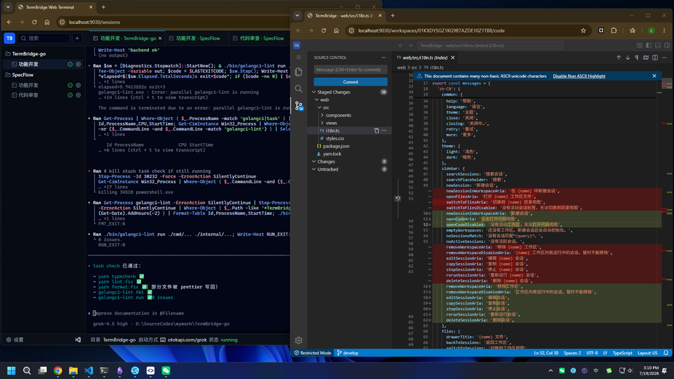
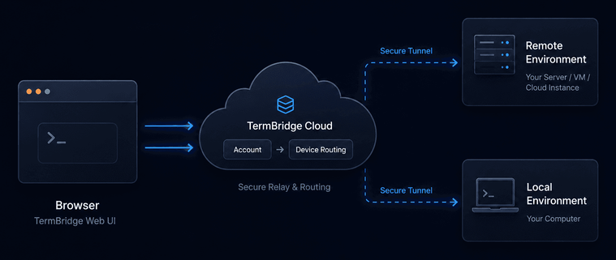

# TermBridge

[中文](README.md) | **English**

**TermBridge** is a local-first, remotely accessible Workspace Runtime platform.

It turns the CLI tools, shells, builds, and debugging tasks you run on a device into manageable, recoverable workflows you can continue from the browser. The browser is for viewing and interaction; commands still execute on the device-local runtime.

## Who it is for

- **Local developers**: Run Claude Code, Codex, shell, and build commands on your machine, and manage those sessions from one browser workspace.
- **Multi-device users**: Bring home PCs, laptops, and VPS hosts into the same workbench, and always know which device you are operating.
- **Remote-access users**: A local Agent connects outbound to the cloud so the browser can reach your device runtime without opening inbound ports on the device.

## Capabilities



- **Devices and workspaces**: Organize work as Device → Workspace → Session with clear ownership.
- **Browser workbench**: Manage sessions, browse history, and attach terminals in the web UI.
- **Remote terminal**: PTY-based interaction with reconnect, resize, and other common terminal behaviors.
- **Code workbench**: VS Code-like editing and file browsing on online devices.
- **Cloud entry**: Accounts, device online status, and routing so you can pick a reachable device from the browser.
- **Local and remote consistency**: One product model for direct local access and cloud-mediated access.

## Architecture



The data plane stays on the device. Cloud handles accounts, online status, and routing only; it does not take over process lifecycle.

| Role | Responsibility |
| --- | --- |
| **Browser** | Workbench UI: devices, workspaces, sessions, terminal, and code editing |
| **Cloud / Gate** | Accounts, device registration, and routing browser traffic to the target device |
| **Agent** | Runs on the user device; owns the local runtime and PTY |
| **Runtime** | Actually executes commands and processes; ownership remains on the device |

The Agent connects outbound to Cloud. The browser does not connect directly to the user device, and no inbound ports need to be opened on the device.

## Quick start

### Requirements

- Go 1.25+
- Node.js and Yarn
- [Task](https://taskfile.dev/)

### Install dependencies

```bash
task deps
```

To install the CLI into the user-level Go bin directory:

```bash
task install
```

### Local development

Start the local Agent, Cloud, and web UI in three terminals:

```bash
task dev:agent
task dev:cloud
task dev:web
```

### Common commands

```bash
task test    # tests
task check   # checks
task build   # build
```

Run roles:

```bash
termbridge agent   # local Agent
termbridge cloud   # Cloud service
```

## Documentation

- [Product design](docs/design/design.md)
- [Product roadmap](docs/design/roadmap.md)

## Status

The project is under active development. APIs and UX may still change. Issues and ideas are welcome.

## License

[MIT](LICENSE)
