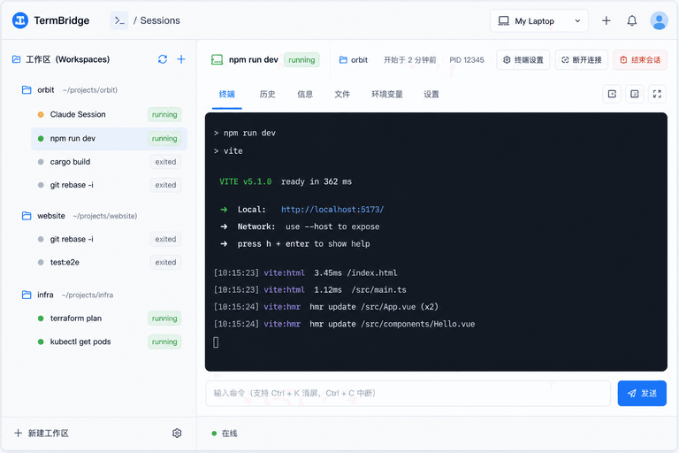

# TermBridge-go

TermBridge-go 是 TermBridge 的 Go 重写版本，当前主要服务于本地开发和产品验证。

核心模型：

```text
Browser -> Gate -> Agent -> Runtime -> PTY / Process
```

产品资源模型：

```text
User -> Device -> Workspace -> Session -> Terminal
```

## 设计文档

- [产品设计](docs/design/design.md)
- [产品路线图](docs/design/roadmap.md)



## 当前状态

当前重点是拆分本地 agent 与 cloud 后端入口，并保留 local direct runtime path 和统一 `/sessions` 工作台：

- `termbridge agent` 启动本地 agent 后端、本机 runtime 与 PTY 能力。
- `termbridge cloud` 启动云端门户后端。
- Browser 通过 `/sessions` 选择 workspace、session 并 attach terminal。
- 本地开发采用一个 Web/Vite dev server 同时代理 agent 与 cloud。
- 镜像交付采用前后端一体：Go 服务提供后端 API 和已构建的前端静态资源。

Cloud Gate PoC 阶段仍是验证态，不是生产发布态。Browser login 已切到 `/api/auth/*` 用户系统；agent 本地入口仍支持配置里的 `admin/admin` shortcut，cloud 入口要求配置 Google OAuth 与 Resend。device 绑定、pairing、credential rotation 后续再补。

## 开发依赖

- Go 1.25+
- Node.js / Yarn
- [Task](https://taskfile.dev/)
- [Air](https://github.com/air-verse/air)

安装依赖：

```bash
task install
```

## 本地开发

同时启动 Web、agent 与 cloud：

```bash
task run
```

也可以分别启动；`task agent` 与 `task cloud` 会注入对应的本地联调端口和 API base：

```bash
task agent
task cloud
task web
```

默认本地联调地址：

```text
web:   http://localhost:9030
agent: http://127.0.0.1:9031
cloud: http://127.0.0.1:9032
```

Vite dev proxy 分流：

```text
/agent-api/* -> http://127.0.0.1:9031
/cloud-api/* -> http://127.0.0.1:9032
```

`/agent-api` 与 `/cloud-api` 只用于本地 Vite 联调，不是最终产品 API path。最终 agent 本机运行和 cloud 云端同源部署时，前端仍按同源 `/api` 访问后端。

## 常用命令

运行测试：

```bash
task test
```

运行完整检查：

```bash
task check
```

构建本地二进制和镜像：

```bash
task build
```

## 配置

默认配置来自 `configs/config.yaml`，这是提交到版本库的只读 baseline。运行环境差异写入 `configs/config.<env>.yaml`，敏感值和运行中生成的本机配置写入项目根目录 `.env` 或 `.env.<env>`，也可以使用系统环境变量覆盖配置。

默认配置优先级：

```text
configs/config.yaml
  < .env
  < OS env
```

如果通过 OS env 设置 `TERMBRIDGE_ENV=<env>`，会额外加载环境配置与环境 `.env`：

```text
configs/config.yaml
  < configs/config.<env>.yaml
  < .env.<env>
  < OS env
```

`TERMBRIDGE_ENV` 只从 OS env 读取，不从 `.env` 或 `.env.<env>` 读取；`.env` / `.env.<env>` 不覆盖已存在的 OS env。未知配置文件 key 和未知环境变量会被忽略。

环境变量命名规则：

```text
TERMBRIDGE_ + 配置 key 大写，并将 . 转为 __
```

本地联调配置示例见 `configs/config.develop.example.yaml`。`task run` 会在未显式设置相关 OS env 时使用等价默认值：

```dotenv
TERMBRIDGE_ENV=develop
TERMBRIDGE_AGENT__LISTEN_URL=http://127.0.0.1:9031
TERMBRIDGE_AGENT__PUBLIC_URL=http://localhost:9030
TERMBRIDGE_AGENT__API_BASE_URL=/agent-api
TERMBRIDGE_CLOUD__LISTEN_URL=http://127.0.0.1:9032
TERMBRIDGE_CLOUD__PUBLIC_URL=http://localhost:9030
TERMBRIDGE_CLOUD__API_BASE_URL=/cloud-api
TERMBRIDGE_CLOUD__OAUTH__REDIRECT_URL=http://localhost:9030/cloud/oauth/callback
```

最终本机 agent 运行示例：

```dotenv
TERMBRIDGE_AGENT__LISTEN_URL=http://127.0.0.1:9030
TERMBRIDGE_RUNTIME__STATE_DIR=.termbridge
TERMBRIDGE_AGENT__STATIC_DIR=web
TERMBRIDGE_AGENT__PUBLIC_URL=http://localhost:9030
TERMBRIDGE_AGENT__API_BASE_URL=
```

镜像内置静态资源示例：

```dotenv
TERMBRIDGE_CLOUD__LISTEN_URL=http://0.0.0.0:80
TERMBRIDGE_CLOUD__STATIC_DIR=/opt/termbridge/web/dist
TERMBRIDGE_CLOUD__PUBLIC_URL=https://cloud.example.com
TERMBRIDGE_CLOUD__API_BASE_URL=
TERMBRIDGE_RUNTIME__STATE_DIR=/var/lib/termbridge
```

用户系统相关配置：

`TERMBRIDGE_JWT__SECRET_KEY` 必须是 base64 编码的 32 字节随机 key（例如 `openssl rand -base64 32`）；普通明文 secret 会在启动校验阶段被拒绝。

```dotenv
TERMBRIDGE_JWT__SECRET_KEY=AAAAAAAAAAAAAAAAAAAAAAAAAAAAAAAAAAAAAAAAAAA=
TERMBRIDGE_DATABASE__DRIVER=sqlite
TERMBRIDGE_DATABASE__SQLITE__PATH=.termbridge/termbridge.db
TERMBRIDGE_AUTH__LOCAL_ADMIN__USERNAME=admin
TERMBRIDGE_AUTH__LOCAL_ADMIN__PASSWORD=admin
TERMBRIDGE_AUTH__GOOGLE__CLIENT_ID=
TERMBRIDGE_AUTH__GOOGLE__CLIENT_SECRET=
TERMBRIDGE_AUTH__GOOGLE__REDIRECT_URL=
TERMBRIDGE_RESEND__API_KEY=
TERMBRIDGE_RESEND__FROM_EMAIL=
```

运行角色由 CLI 子命令选择：`termbridge agent` 启动本地 agent 后端与本机控制台能力，`termbridge cloud` 启动云端门户后端。配置文件不再通过 `server.mode` 选择角色。

设备身份由 `termbridge agent` 在 `<runtime.state_dir>/device.json` 中生成并读取；Cloud 绑定摘要只记录非 token 的 gate URL、device id、device name 和连接时间，业务运行中变化的配置不会写回 `configs/config.yaml`。

## 当前边界

当前还不是完整生产版本，仍未完成：

- 用户与 device 绑定。
- secure pairing。
- device credential / rotation。
- 完整远程 Gate + 独立 Local Agent 的真实部署验证。
- 发布包、安装升级、生产运维文档。

README 当前只作为开发入口说明；正式发布前会重写用户向文档。
