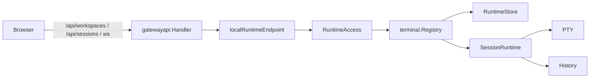
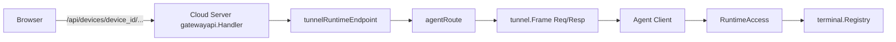
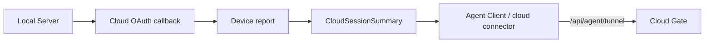
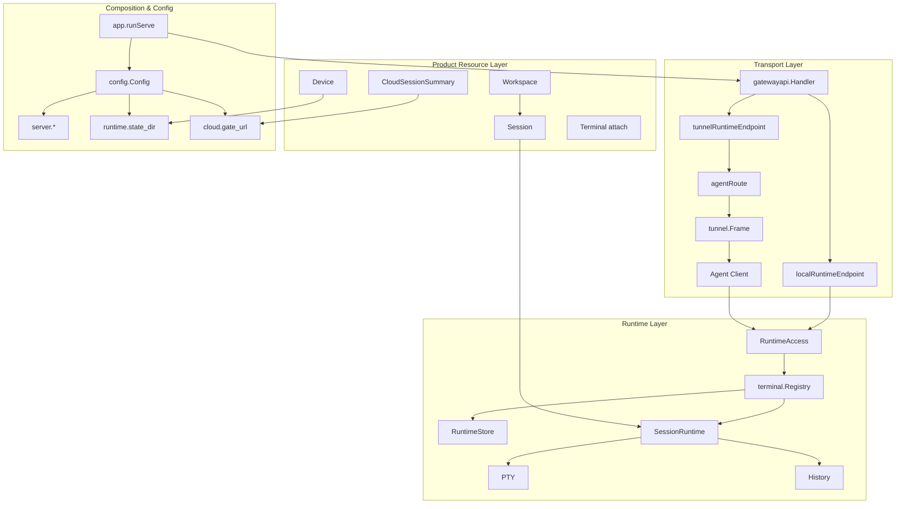

# TermBridge 核心抽象和业务流程

最后修改时间: 2026-07-02 14:44:57

> 本文用于统一当前 TermBridge 的核心业务模型、模块边界和 local/cloud 运行流程。内容以当前代码中已经存在的类型、接口、路由、协议和配置为依据；目标态或后续建议只放在明确标注的章节中。

## 1. 核心定位

TermBridge 的核心业务是：

```text
Browser 管理并连接某个 Runtime 上的 Workspace / Session / Terminal。
```

最短主链路是：

```text
Browser
  -> Server API / WebSocket
  -> RuntimeEndpoint
  -> RuntimeAccess
  -> terminal.Registry
  -> RuntimeStore / SessionRuntime / PTY / History
```

local mode 下，`RuntimeEndpoint` 直接调用本机 `RuntimeAccess`。

cloud mode 下，`RuntimeEndpoint` 通过 `agentRoute` 和 tunnel frame 访问远端 Agent Client，再由远端 Agent Client 调用它本机的 `RuntimeAccess`。

因此，TermBridge 当前最重要的抽象边界是：

```text
RuntimeAccess    Runtime 能力边界
RuntimeEndpoint  Browser API 到 Runtime 能力的 local/cloud 适配边界
tunnel Req/Resp  Cloud/Agent 之间的协议边界
```

---

## 2. 分层模型

当前实现可以按四层理解：

```text
Product Resource Layer
  Workspace / Session / Terminal / Device / CloudSessionSummary

Runtime Layer
  RuntimeAccess / terminal.Registry / RuntimeStore / SessionRuntime / PTY / History

Transport Layer
  gatewayapi.Handler / RuntimeEndpoint / agentRoute / Agent Client / tunnel.Frame

Composition & Configuration Layer
  app.runServe / config.Config / server.* / runtime.state_dir / cloud.gate_url
```

这四层的职责分别是：

| Layer | 职责 | 主要代码 |
| --- | --- | --- |
| Product Resource | 用户可理解的业务资源和状态 | `internal/domain/*`, `internal/application/terminal/dto.go`, `internal/transport/http/gatewayapi/dto.go` |
| Runtime | 真实 workspace/session/terminal 执行与持久化 | `internal/application/terminal/*`, `internal/application/agent/runtime_access.go` |
| Transport | HTTP、WebSocket、tunnel frame 的请求适配和转发 | `internal/transport/http/gatewayapi/*`, `internal/application/agent/client.go`, `internal/protocol/tunnel/frame.go` |
| Composition & Configuration | 当前进程角色、依赖装配、配置加载和运行拓扑 | `internal/app/app.go`, `internal/infrastructure/config/config.go` |

---

## 3. Product Resource Layer

### 3.1 Workspace

`Workspace` 是一组 session 的容器，当前实现中与本地路径强相关。

代码位置：

```text
internal/domain/workspace/workspace.go
```

核心含义：

```text
Workspace = path-backed session container
```

主要字段：

```text
id
name
path
session_ids
children
created_at / updated_at
```

当前 `workspace.Resolver` 会根据 cwd/path 解析或创建 workspace。因此，现阶段最准确的业务描述是：

```text
Workspace 表示绑定到某个本地路径的一组 Session。
```

### 3.2 Session

`Session` 是持久化的终端会话记录。

代码位置：

```text
internal/domain/session/session.go
```

它记录：

```text
session_id
workspace_id
name
launch_cwd
command
history config
created_at / updated_at
```

关键边界：

```text
Session 是业务记录。
SessionRuntime 是运行中的 PTY 会话。
Terminal WebSocket 是一次 attach 连接。
```

也就是说，`Session` 本身不是进程、不是 PTY，也不是 WebSocket。

### 3.3 Session state

当前 session 状态定义在：

```text
internal/domain/session/state.go
```

当前状态集合：

```text
running
stopped
failed
```

`SessionRuntime.waitLoop` 会在 PTY 退出后保存 exit record，并将 session 最终状态保存为 `stopped` 或 `failed`。

### 3.4 Terminal

`Terminal` 不是独立持久化资源，而是用户 attach 到某个 running session 后获得的交互通道。

它包含：

```text
history replay
live output
input
resize
detach / close
```

当前 terminal protocol 位于：

```text
internal/protocol/terminal/protocol.go
```

本地 attach 和 cloud attach 最终都收敛到：

```text
RuntimeAccess.Attach(workspace_id, session_id)
```

### 3.5 Device

`Device` 是一个可提供 Runtime 能力的 TermBridge 实例身份。

代码位置：

```text
internal/application/agent/device.go
```

当前更准确的业务含义是：

```text
Device = Runtime provider identity
```

它服务于：

```text
1. runtime state 的 device scope。
2. Cloud OAuth device report。
3. Agent tunnel signing。
4. Cloud Gate 上的 online device 展示和路由。
```

设备身份由 runtime state 管理，不是 Viper 配置字段：

```text
<runtime.state_dir>/agent.json
<runtime.state_dir>/devices/<device_id>/private_key.pem
<runtime.state_dir>/devices/<device_id>/public_key.pem
```

### 3.6 DeviceSummary

`DeviceSummary` 是 Gateway API 暴露给 Browser 的设备摘要。

代码位置：

```text
internal/transport/http/gatewayapi/dto.go
```

字段：

```text
id
name
online
status
connected_at
last_seen
```

运行时在线表由 `gatewayapi.DeviceRegistry` 维护。

### 3.7 CloudSessionSummary

`CloudSessionSummary` 表示本机完成 Cloud OAuth / device report 后，与某个 Cloud Gate 建立连接关系的摘要。

代码位置：

```text
internal/transport/http/gatewayapi/dto.go
```

字段：

```text
gate_url
device_id
device_name
connected_at
```

它表达的是：

```text
Local Device 与 Cloud Gate 的连接摘要。
```

---

## 4. Runtime Layer

### 4.1 RuntimeAccess

`RuntimeAccess` 是 Runtime 能力对 transport / agent 暴露的应用接口。

代码位置：

```text
internal/application/agent/runtime_access.go
```

接口能力：

```text
ListWorkspaces
WorkspaceTree
UpdateWorkspaceOrder
DeleteWorkspace
ListSessionsByWorkspaceId
UpdateSessionOrder
CreateSession
RerunSession
GetSession
UpdateSession
DeleteSession
CloseSession
ReadHistory
Attach
```

当前实现：

```text
agent.WebTerminalAccess -> terminal.Registry
```

这条边界很重要：

```text
HTTP API 和 tunnel request 都应该通过 RuntimeAccess 访问 Runtime 能力。
```

### 4.2 terminal.Registry

`terminal.Registry` 是 Runtime 内部的应用服务聚合点。

代码位置：

```text
internal/application/terminal/registry.go
```

职责：

```text
1. 创建 session。
2. rerun session。
3. attach session。
4. close session。
5. list/update/delete workspace/session。
6. 读取 history。
7. 维护 active SessionRuntime map。
8. 防止同一 session 重复启动。
```

`Registry` 依赖：

```text
RuntimeStore
termpty.Manager
history.Config
```

### 4.3 RuntimeStore

`RuntimeStore` 是 workspace/session/runtime record 的持久化接口。

代码位置：

```text
internal/application/terminal/registry.go
internal/infrastructure/repository/state/*
```

覆盖的数据：

```text
Workspace
Session
StateRecord
ProcessRecord
ExitRecord
HistoryPath
```

`RuntimeStore` 不处理 HTTP、Cloud、Agent 或 Browser 概念。

### 4.4 SessionRuntime

`SessionRuntime` 是一个正在运行的 session 的内存态执行对象。

代码位置：

```text
internal/application/terminal/runtime.go
```

它持有：

```text
session.Session
termpty.Session
history.Writer
attached terminal.Client map
attachment state
```

核心流程：

```text
start()
  -> readLoop(): PTY output -> history -> clients
  -> waitLoop(): PTY wait -> SaveExit -> SaveState -> close clients -> remove runtime
```

### 4.5 terminal.Client / agent.TerminalStream

`terminal.Client` 是 Registry attach 后得到的 runtime-side client。

`agent.TerminalStream` 是 Agent / RuntimeAccess 层暴露给 transport 的 terminal stream 接口。

它们共同表达一个能力：

```text
Outbound output
WriteInput(data)
Resize(cols, rows)
Detach(reason)
```

---

## 5. Transport Layer

### 5.1 gatewayapi.Handler

`gatewayapi.Handler` 是当前 server 进程的 Browser-facing API / WebSocket / Agent Tunnel 聚合器。

代码位置：

```text
internal/transport/http/gatewayapi/server.go
```

它聚合：

```text
AuthService
DeviceRepository
DeviceRegistry
agent routes
cloud session summary
local RuntimeEndpoint
```

当前主要入口：

```text
/api/auth/*
/api/cloud-oauth/*
/api/devices
/api/devices/current
/api/devices/{device_id}/...
/api/agent/tunnel
/api/workspaces...
/api/sessions...
```

### 5.2 RuntimeEndpoint

`RuntimeEndpoint` 是 Browser API 到 Runtime 能力的适配策略。

代码位置：

```text
internal/transport/http/gatewayapi/runtime_endpoint.go
```

接口：

```text
JSON(ctx, method, params, requestId)
History(ctx, workspaceId, sessionId, requestId)
Attach(w, r, workspaceId, sessionId)
Available()
```

当前实现：

```text
localRuntimeEndpoint
  -> RuntimeAccess

tunnelRuntimeEndpoint
  -> agentRoute
```

这个抽象负责收敛 local/cloud 分流。

### 5.3 localRuntimeEndpoint

local endpoint 直接调用本机 RuntimeAccess。

JSON 请求流程：

```text
Browser /api/...
  -> gatewayapi.Handler
  -> localRuntimeEndpoint.JSON
  -> agent.HandleRuntimeRequest
  -> RuntimeAccess
  -> terminal.Registry
```

terminal attach 流程：

```text
Browser WebSocket
  -> localRuntimeEndpoint.Attach
  -> bridgeTerminalStream
  -> RuntimeAccess.Attach
  -> terminal stream
```

### 5.4 tunnelRuntimeEndpoint

cloud/device-scoped endpoint 通过 `agentRoute` 转发。

JSON 请求流程：

```text
Browser /api/devices/{device_id}/...
  -> gatewayapi.Handler
  -> tunnelRuntimeEndpoint.JSON
  -> agentRoute.request
  -> tunnel.Frame{type=request}
  -> Agent Client
  -> RuntimeAccess
```

terminal attach 流程：

```text
Browser WebSocket
  -> tunnelRuntimeEndpoint.Attach
  -> handleTerminalWS
  -> agentRoute terminal stream
  -> tunnel terminal_* frames
  -> Agent Client
  -> RuntimeAccess.Attach
```

### 5.5 agentRoute

`agentRoute` 是 Cloud/server 侧某个 online device 的 tunnel route。

代码位置：

```text
internal/transport/http/gatewayapi/route.go
```

职责：

```text
1. 保存 device_id 对应的 websocket conn。
2. 把 HTTP JSON request 转成 tunnel request frame。
3. 管理 pending response。
4. 管理 terminal relay stream。
5. 分发 terminal output / close / error frame。
```

### 5.6 Agent Client

`agent.Client` 是 Runtime provider 侧的 tunnel client。

代码位置：

```text
internal/application/agent/client.go
```

职责：

```text
1. 使用 Device identity 签名连接 /api/agent/tunnel。
2. 发送 hello frame。
3. 处理 request frame。
4. 将 request method 分派到 RuntimeAccess。
5. 处理 terminal_attach / terminal_input / terminal_resize。
6. 回传 response / terminal_output / terminal_closed。
```

`agent.Client.Config.ConnectUrl` 是装配层传入的运行参数。远端连接目标来自 `cloud.gate_url`。

### 5.7 Tunnel protocol

Tunnel frame 定义在：

```text
internal/protocol/tunnel/frame.go
```

Frame type：

```text
hello
hello_ack
ping
pong
request
response
terminal_attach
terminal_input
terminal_output
terminal_resize
terminal_closed
error
close
```

JSON request/response 协议：

```go
type RequestReq struct {
    Method    string          `json:"method"`
    Params    json.RawMessage `json:"params,omitempty"`
    RequestId string          `json:"request_id,omitempty"`
}

type ResponseResp struct {
    OK     bool            `json:"ok"`
    Result json.RawMessage `json:"result,omitempty"`
    Error  string          `json:"error,omitempty"`
}
```

当前 runtime request method：

```text
workspaces
workspace_tree
workspace_order
delete_workspace
workspace_sessions
session_order
create_session
rerun_session
get_session
update_session
delete_session
close_session
history
```

这些 method name 是 Cloud/Agent tunnel 协议的一部分。

---

## 6. Composition & Configuration Layer

### 6.1 app.runServe

`app.runServe` 负责按配置装配当前进程。

代码位置：

```text
internal/app/app.go
```

local mode 装配重点：

```text
1. 打开 DB 并执行 migration。
2. LoadOrCreateDevice(runtime.state_dir)。
3. UpsertLocalDevice。
4. LoadDevicePublicKey。
5. 创建 device-scoped RuntimeStore。
6. 创建 terminal.Registry。
7. 创建 RuntimeAccess。
8. 构造 gatewayapi.Handler，注入 LocalRuntime。
9. 启动 HTTP server。
10. cloud.gate_url 配置存在时，创建 cloud connector。
```

cloud mode 装配重点：

```text
1. 打开 DB 并执行 migration。
2. 创建 auth/device repository。
3. 构造 gatewayapi.Handler。
4. 启动 HTTP server。
5. 接收远端 Agent Client 的 /api/agent/tunnel。
```

### 6.2 server 配置

`server` 节点表达当前进程 HTTP/API server 配置。

代码位置：

```text
internal/infrastructure/config/config.go
configs/config.yaml
```

字段：

```text
server.mode        当前 server 运行模式：local / cloud
server.listen_url  当前进程监听地址
server.static_dir  当前进程提供的 Web 静态资源目录
server.public_url  Browser 访问当前 server 的外部地址
```

### 6.3 runtime.state_dir

`runtime.state_dir` 表达当前 Runtime 的状态目录。

它承载：

```text
agent.json
devices/<device_id>/private_key.pem
devices/<device_id>/public_key.pem
devices/<device_id>/workspaces...
history files
cloud oauth attempt store
```

### 6.4 cloud.gate_url

`cloud.gate_url` 表达本机 local server 要连接的远端 Cloud Gate。

它用于：

```text
Cloud OAuth exchange target
device report target
cloud connector target
```

### 6.5 gate 配置

当前 `gate` 节点只保留 API 行为配置：

```text
gate.api.expose_errors
```

WebSocket origin pattern 由当前 request host 生成。

---

## 7. 核心拓扑

### 7.1 Local direct runtime path



业务含义：

```text
当前进程同时是 Browser-facing server 和 Runtime provider。
```

### 7.2 Cloud tunnel runtime path



业务含义：

```text
Cloud Server 是 Browser portal 和 tunnel relay。
Runtime 能力由远端 Agent Client 所在设备提供。
```

### 7.3 Local server connects to Cloud Gate



业务含义：

```text
本机 Runtime provider 通过 Cloud OAuth 和 device report 建立 Cloud 连接摘要，然后启动 cloud connector。
```

---

## 8. 核心业务流程

### 8.1 serve 启动流程：local mode

```text
config.Load
  -> database.Open + migrate
  -> agent.LoadOrCreateDevice(runtime.state_dir)
  -> load device public key
  -> state.NewDBStore(db, runtime.state_dir/devices/device_id, device_id)
  -> terminal.NewRegistry
  -> agent.WebTerminalAccess{Registry}
  -> gatewayapi.New(LocalRuntime=runtimeAccess, ServerMode=local)
  -> httpserver.New(server.listen_url, server.static_dir)
  -> serve
  -> cloud.gate_url 存在时，准备 cloud connector
```

### 8.2 serve 启动流程：cloud mode

```text
config.Load
  -> database.Open + migrate
  -> auth/device repositories
  -> gatewayapi.New(ServerMode=cloud)
  -> httpserver.New(server.listen_url, server.static_dir)
  -> serve
  -> accept /api/agent/tunnel
```

### 8.3 创建 Session

统一业务流程：

```text
CreateSession request
  -> RuntimeEndpoint.JSON(method=create_session)
  -> RuntimeAccess.CreateSession
  -> terminal.Registry.CreateSession
  -> validate name / command / cwd / terminal size
  -> resolve workspace
  -> session.Manager.Create
  -> persist session and workspace order
  -> claim session start
  -> create history writer
  -> start PTY
  -> SaveProcess
  -> SaveState(running)
  -> create SessionRuntime
  -> start readLoop / waitLoop
  -> return CreateSessionResp
```

local 和 cloud 的差异在进入 RuntimeAccess 之前：

```text
local: Browser -> localRuntimeEndpoint -> RuntimeAccess
cloud: Browser -> tunnelRuntimeEndpoint -> agentRoute -> Agent Client -> RuntimeAccess
```

### 8.4 Attach Terminal

local attach：

```text
Browser WebSocket
  -> localRuntimeEndpoint.Attach
  -> bridgeTerminalStream
  -> RuntimeAccess.Attach
  -> terminal.Registry.Attach
  -> SessionRuntime.attach
  -> replay history
  -> live output/input/resize
```

cloud attach：

```text
Browser WebSocket
  -> tunnelRuntimeEndpoint.Attach
  -> handleTerminalWS
  -> agentRoute.addTerminal
  -> tunnel terminal_attach
  -> Agent Client handleTerminal
  -> RuntimeAccess.Attach
  -> terminal stream
  -> tunnel terminal_output/input/resize/closed
```

### 8.5 PTY output and exit

```text
SessionRuntime.start
  -> readLoop
       PTY output
         -> history.Write
         -> publishBinary to attached clients
  -> waitLoop
       PTY wait
         -> history.Close
         -> SaveExit
         -> SaveState(stopped/failed)
         -> broadcast exited
         -> close clients
         -> remove runtime
```

### 8.6 Rerun Session

```text
RerunSession request
  -> RuntimeAccess.RerunSession
  -> terminal.Registry.RerunSession
  -> load existing session view
  -> require terminal state stopped/failed
  -> reuse existing command and launch cwd
  -> archive current history
  -> begin new session run if store supports it
  -> start SessionRuntime again
```

业务语义：

```text
rerun 是同一个 session_id 的新 run。
```

### 8.7 Agent Tunnel handshake

```text
Agent Client
  -> LoadOrCreateDevice
  -> load device private key
  -> sign tunnel request
  -> websocket GET /api/agent/tunnel
  -> send hello{device_id, device_name, protocol_version}
  -> Gateway verifies request
  -> Gateway registers DeviceSummary online
  -> Gateway creates agentRoute(device_id)
  -> Gateway sends hello_ack
  -> both sides enter frame read loop
```

### 8.8 HTTP JSON relay over tunnel

```text
Browser
  -> GET/POST /api/devices/{device_id}/...
  -> gatewayapi.Handler
  -> tunnelRuntimeEndpoint.JSON
  -> agentRoute.request(method, params, request_id)
  -> tunnel.Frame{type=request, payload=RequestReq}
  -> Agent Client handleRequest
  -> agent.HandleRuntimeRequest
  -> RuntimeAccess
  -> tunnel.Frame{type=response, payload=ResponseResp}
  -> HTTP JSON response
```

### 8.9 Cloud OAuth device connection

```text
Local UI
  -> /api/cloud-oauth/start or authorize flow
  -> CloudOAuthAttemptStore creates state
  -> POST /api/cloud-oauth/callback {code,state}
  -> CompleteAttempt(state)
  -> POST cloud.gate_url/api/cloud-oauth/exchange
  -> receive access_token
  -> POST cloud.gate_url/api/devices/current {id,name,public_key}
  -> set CloudSessionSummary
  -> start cloud connector
```

---

## 9. Frontend 对齐

### 9.1 RuntimeTarget

前端 Runtime API 目标由 `RuntimeTarget` 表达。

代码位置：

```text
web/src/features/runtimeTarget.ts
```

类型：

```ts
type RuntimeTarget = { mode: 'local' } | { mode: 'cloud'; deviceId: string }
```

路径规则：

```text
local -> /api{path}
cloud -> /api/devices/{device_id}{path}
```

`RuntimeTarget` 只决定 API path shape。

### 9.2 Sessions UI

`/sessions` 工作台的核心上下文是：

```text
current runtime target
current workspace
current session
current device / cloud session summary
```

状态栏组件负责展示当前 device/session 状态；API helper 和 store 只提供事实和目标，不负责提前决定最终展示文案。

---

## 10. 关键边界规则

### 10.1 Runtime 业务收敛到 Runtime Layer

Workspace / Session / PTY / History 的业务规则应位于：

```text
terminal.Registry
RuntimeStore
SessionRuntime
RuntimeAccess implementation
```

### 10.2 Transport 负责翻译和转发

HTTP / WebSocket / tunnel 层负责：

```text
decode request
auth / route lookup
call RuntimeEndpoint / RuntimeAccess / agentRoute
encode response
```

### 10.3 local/cloud 分流收敛在 RuntimeEndpoint

分流模型：

```text
Browser request
  -> RuntimeEndpoint
       local -> RuntimeAccess
       cloud -> agentRoute -> Agent Client -> RuntimeAccess
```

进入 RuntimeAccess 后，workspace/session/terminal 业务语义保持一致。

### 10.4 Tunnel Req/Resp 是协议边界

以下内容属于协议面：

```text
RequestReq
ResponseResp
runtime request method names
terminal frame types
```

内部 Go 类型可以调整，但 tunnel 协议需要显式评估影响。

### 10.5 配置表达部署事实，state 表达运行身份

配置表达：

```text
server 如何监听和暴露
runtime state 在哪里
local server 连接哪个 cloud gate
auth/database/log/history 策略
```

运行身份表达在 state 中：

```text
agent.json
private_key.pem
public_key.pem
```

---

## 11. 当前模型图谱总览



---

## 12. 后续可基于本文推进的工作

本文可以作为后续三类工作的共同基线：

```text
1. RuntimeEndpoint 测试补强：锁定 local direct path 与 cloud tunnel path。
2. Cloud mode contract 回归：锁定 tunnel Req/Resp、method names、terminal frame 行为。
3. Sessions workbench 收敛：让 RuntimeTarget、current device、current session 的职责边界与后端模型一致。
```
