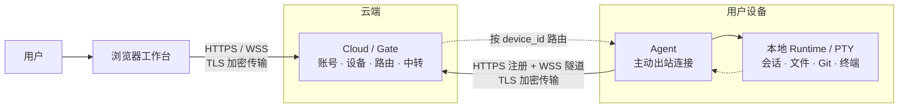
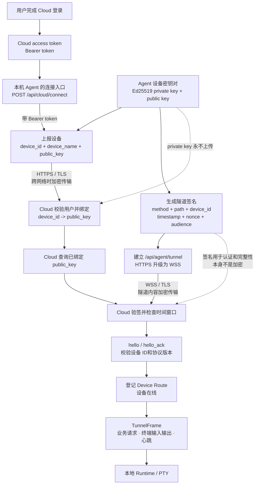
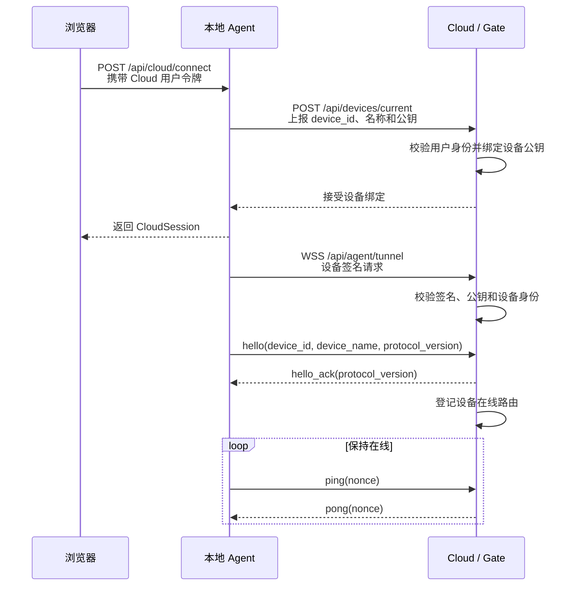
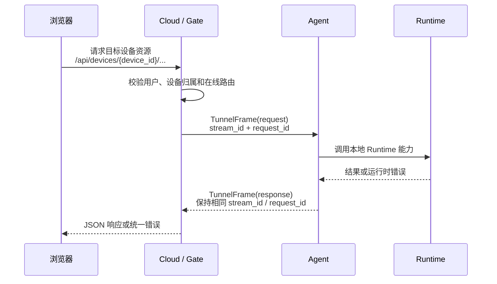
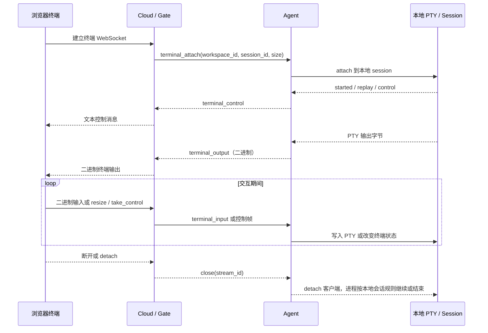
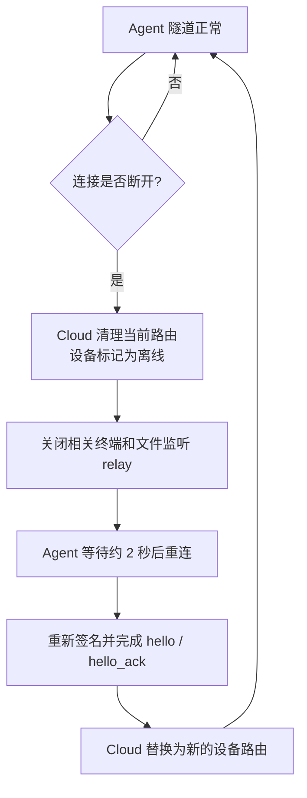
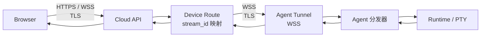

# 云端客户端通信说明

本文从系统视角说明 TermBridge 的云端客户端通信方式，帮助读者理解“浏览器如何访问另一台设备”。不要求先阅读 Agent、Cloud 或 WebSocket 的全部实现。

## 一句话概括

在远程访问场景中，设备侧的 Agent 主动连接 Cloud，Cloud 保存设备的在线路由；浏览器工作台只连接 Cloud，由 Cloud 将工作区、文件、Git 和终端请求转发给目标设备。浏览器可以先通过本机 Agent 发起 Cloud 连接，但命令和进程仍然运行在设备本地。

## 加密与认证分层

下面的流程图把通信中的三种安全机制分开：TLS 负责传输中的保密性，Cloud 用户令牌负责用户身份，设备签名负责确认“这条隧道确实来自已绑定设备”。

### 图中安全机制的含义

| 层次 | 作用 | 当前通信中的体现 |
| --- | --- | --- |
| TLS 传输加密 | 防止网络中间人直接读取 HTTPS/WSS 内容 | 生产环境的 Cloud 地址使用 `https://`，隧道使用 `wss://`；业务帧由 TLS 保护 |
| Cloud 用户认证 | 确认哪个 Cloud 用户在绑定或访问设备 | `Authorization: Bearer <token>`，用于设备上报、设备列表和 Cloud API |
| 设备身份认证 | 确认隧道来自已绑定设备，并防止请求被篡改 | Agent 用 Ed25519 私钥签名，Cloud 用已保存的公钥验签 |
| 防重放 | 限制窃取的旧签名被再次使用 | 签名包含时间戳和 nonce；当前允许的时间偏差为约 5 分钟 |
| 本机密钥边界 | 限制设备私钥泄露范围 | 私钥只留在 Agent 所在设备，Cloud 只保存公钥 |

需要区分两件事：**Ed25519 签名不是加密**。它证明请求来自持有私钥的设备，并保证签名内容未被修改；真正保护业务帧和终端字节不被网络旁路读取的是 HTTPS/WSS 的 TLS。当前协议没有在每个 `TunnelFrame` 上再做一层独立的端到端加密。

本机浏览器到本机 Agent 的连接属于本机边界，开发配置可以使用 HTTP；上图中的 TLS 重点指浏览器访问 Cloud、Agent 访问 Cloud 等跨网络链路。对外部署 Cloud 时，应使用 HTTPS，使 Agent 使用对应的 WSS 隧道。

核心边界是：

| 组件 | 主要职责 | 不负责什么 |
| --- | --- | --- |
| Browser | 登录、选择设备、展示工作区和终端、发起操作 | 不直接访问用户设备 |
| Cloud / Gate | 用户鉴权、设备绑定、在线状态、请求路由和数据中转 | 不拥有设备上的进程生命周期 |
| Agent | 使用设备身份连接 Cloud，将请求交给本地 Runtime，并回传结果 | 不把本地进程迁移到 Cloud |
| Runtime / PTY | 执行命令、管理会话、读写文件和终端输入输出 | 不负责跨网络寻址 |

## 连接建立

连接建立分为“设备绑定”和“隧道建立”两个阶段。设备绑定使用短请求完成，隧道建立使用长期 WebSocket 连接完成。

### 连接中的身份与安全

- Agent 使用本地持久化的 Ed25519 设备密钥。设备 ID 由设备公钥派生，设备名称只是展示信息。
- 上报设备时，Cloud 将设备、公钥和当前 Cloud 用户建立绑定；同一设备 ID 不能静默替换成另一把公钥。
- Agent 建立隧道时，在请求头中携带设备 ID、时间戳、随机 nonce 和签名。签名覆盖请求方法、路径、设备 ID、时间戳、nonce 及 Cloud audience。
- Cloud 先通过设备 ID 找到已绑定公钥，再验证签名和时间窗口；WebSocket 建立后还要校验 `hello` 中的设备 ID和协议版本。
- 当前隧道协议版本为 `5`。Agent 默认每 `25` 秒发送一次心跳；连接在约 `75` 秒没有消息时视为失活。

## 普通业务请求

工作区、会话、快捷方式、文件和 Git 操作都遵循同一个请求响应模型。浏览器看到的是 Cloud API，Agent 看到的是复用同一条隧道的协议帧。

`stream_id` 用来区分同一条隧道上的并发流，`request_id` 用来关联一次请求与响应。Cloud 不需要为每个 API 请求新建一条设备连接。

同一隧道还承载工作区文件变更订阅：Cloud 将浏览器的订阅转成 Agent 的订阅帧，Agent 从本地文件监听得到事件后，再沿原流返回给浏览器。

## 终端实时通信

终端与普通 JSON 请求不同，它需要持续传输输入、输出和控制事件。浏览器与 Cloud 之间有一条终端 WebSocket，Cloud 与 Agent 之间复用设备隧道中的一个终端流。

终端通信的几个关键点：

- 终端字节使用二进制消息传输，控制状态使用文本消息或协议控制帧传输。
- Cloud 负责用户鉴权、设备路由、连接配额和中转；Agent 才能访问真实 PTY。
- 多个浏览器可以观察同一会话时，Agent 维护 attach 关系和 controller/observer 角色；输入最终由 Agent 检查后才会写入 PTY。
- 浏览器断开只关闭自己的 attach；设备隧道断开时，Cloud 会关闭该设备关联的浏览器 relay，Agent 会清理对应的终端和文件监听。

## 断线与恢复

- Agent 的本地 HTTP 工作台不会因为 Cloud 隧道失败而停止；连接器会独立记录失败并重试。
- Cloud 只会让仍然拥有当前路由的连接将设备标记为离线。重连产生新路由时，旧连接不会把设备状态错误地改回离线。
- 重连成功后，设备重新出现在在线设备列表；浏览器侧需要重新建立受影响的终端或订阅流。
- 设备离线时，支持缓存的工作区树或历史数据可以作为只读结果返回；需要实时 Runtime 的操作会得到设备离线或上游不可用错误。

## 从浏览器到 Runtime 的完整路径

下面的图适合在排查“请求到底经过了哪里”时使用：

这条路径中的网络方向始终是：

- 浏览器到 Cloud：用户访问方向；
- Agent 到 Cloud：设备主动出站方向；
- Cloud 到 Agent：借助 Agent 已建立的 WebSocket 回传或下发；
- Agent 到 Runtime：本机进程调用和 PTY 读写。

因此设备不需要开放入站端口，浏览器也不需要知道设备的局域网地址。

## 术语速查

| 术语 | 含义 |
| --- | --- |
| Cloud Client | Agent 内部负责连接 Cloud、收发隧道帧的连接器；不是浏览器里的 API client |
| Agent Tunnel | Agent 与 Cloud 之间的长期 WSS 连接 |
| Device Route | Cloud 中把 `device_id` 映射到当前 Agent 隧道的内存路由 |
| TunnelFrame | 隧道内承载请求、响应、终端数据和控制事件的统一消息 |
| Runtime | 设备侧对工作区、会话、文件、Git 和终端能力的统一访问面 |
| PTY | 设备上真实命令进程使用的伪终端；命令不会在 Cloud 执行 |

## 继续阅读

产品整体模型见 [产品设计](./design.md)，阶段目标见 [产品路线图](./roadmap.md)。若需要追踪当前实现，优先查看：

- Agent 连接器：`internal/agent/application/user/cloud_client.go`
- Agent 连接生命周期：`internal/agent/application/bootstrap/server.go`
- Cloud 路由与 relay：`internal/cloud/api/handler/server.go`、`internal/cloud/api/handler/route.go`
- 隧道消息定义：`proto/termbridge/shared/v1/tunnel.proto`
