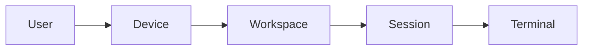
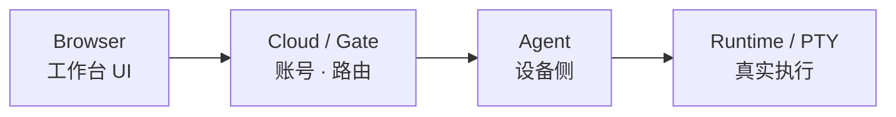
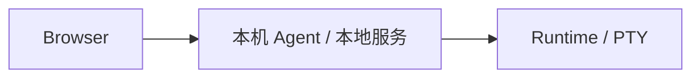
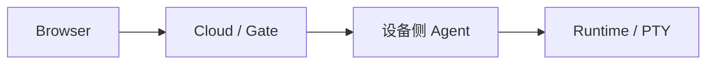
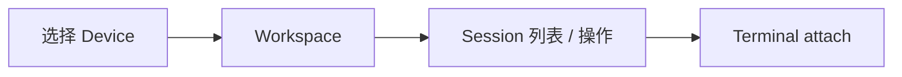

# TermBridge 产品设计

## 定位

**TermBridge** 是本地优先、可远程访问的 **Workspace Runtime 平台**。

开发者的 CLI agent、Shell、构建与调试任务通常跑在某一台具体设备上。TermBridge 把这些工作整理成可管理、可恢复、可在浏览器中继续操作的会话，而**不把进程所有权搬到云端**。

产品承诺：

- 在设备上启动的会话可记录、可恢复、可管理。
- 浏览器中能按设备、工作区、会话查看与操作。
- 可从其他设备安全访问本机 runtime（Agent 出站连接，无需入站端口）。
- 命令真实运行位置始终清晰：Browser / Cloud 负责管理与交互，Runtime 留在设备侧。

## 目标用户

| 角色 | 典型诉求 |
| --- | --- |
| **本地开发者** | 在本机跑 Claude Code、Codex、Shell、构建命令，在浏览器里统一查看、恢复、管理会话。 |
| **多设备用户** | Home PC、笔记本、VPS 出现在同一工作台，并始终知道当前操作哪一台。 |
| **远程访问用户** | 人不在设备旁时，经云端进入本机终端与代码工作台，且体验与本地直连一致。 |

## 资源模型

| 概念 | 含义 |
| --- | --- |
| **User** | 使用产品的人；账号、设备绑定与授权的主体。 |
| **Device** | 运行 Agent 与本机 runtime 的机器；工作台第一层选择对象。 |
| **Workspace** | 一个项目/工作目录；组织该目录下的会话。 |
| **Session** | 一次命令运行记录；管理与继续工作的基本单位。 |
| **Terminal** | 与 session 背后 PTY/进程交互的界面：输入、输出、resize、attach、历史。 |

补充能力（挂在 Device / Workspace 上，不改变上述主模型）：

- **代码工作台**：在在线设备上以类 VS Code 的方式浏览与编辑文件。
- **文件 / Git 视图**：围绕同一 workspace 的文件与版本信息（随产品演进）。

## 系统架构

| 角色 | 职责 |
| --- | --- |
| **Browser** | 云端入口、设备列表、会话工作台、终端与代码编辑 UI。 |
| **Cloud / Gate** | 账号与鉴权、设备注册/在线状态、将浏览器请求路由到目标设备。 |
| **Agent** | 部署在用户设备上；出站连接云端；持有本机 runtime。 |
| **Runtime** | 在本机执行进程与 PTY；生命周期归属设备，不归属浏览器或云端。 |

### 两种使用形态

**本机 / 混合**

适合单机开发：浏览器访问本机服务，直接操作当前设备。

**经云端远程**

适合多设备与外出场景：Agent 主动连云，浏览器从不直连用户设备。

两种形态共用同一套资源模型与交互语义，差异主要在接入路径与鉴权边界。

## 产品表面

### 云端入口

- 账号登录与身份。
- 设备列表（在线 / 离线）、选择设备进入工作台。
- 离线设备绑定的管理（例如移除绑定）。

### 会话工作台

核心路径：

承载：工作区树、会话创建/关闭/删除/重跑、历史、终端 attach。

### 代码工作台

在在线设备上打开 workspace 的编辑器体验（类 VS Code），与会话/终端互补：一个偏「跑命令」，一个偏「看改代码」。

### CLI（设备侧）

本机用 CLI 把一次命令跑进 TermBridge 的 session 体系，例如启动 shell 或 agent CLI，使其可在浏览器中继续管理。

## 体验原则

1. **Device 优先**  
   先明确「正在操作哪台设备、是否可操作」。单设备尽量直达工作台；多设备由用户明确选择。

2. **状态可信**  
   Workspace / Session / Terminal 必须属于当前选中设备；切换设备时不得串状态。

3. **Runtime 所有权清晰**  
   进程跑在 Agent 所在设备；Cloud 与 Browser 只做访问与管理，不拥有用户进程生命周期。

4. **本地与远程一致**  
   资源模型与主路径交互一致；部署位置可变，产品概念不变。

5. **失败可理解**  
   用户能区分：设备离线、路由不可用、鉴权失败、runtime 错误、非法操作。

## 边界与非目标

**TermBridge 做：**

- 把设备上的会话与工作区变成可远程管理的工作流。
- 在浏览器中提供终端与代码工作台。
- 以出站 Agent + 云端路由实现安全远程访问。

**TermBridge 不做（当前定位）：**

- 不把用户开发机变成云端托管的完整 CI/CD 平台。
- 不替代通用云 IDE 的全部协作/多租户企业能力（除非后续单独规划）。
- 不隐瞒命令实际执行位置；「像本地一样」指体验一致，不是进程搬迁。

## 质量标准

进入更广泛使用前，产品路径至少应满足：

1. 用户始终知道当前 device 与是否可操作。
2. 跨 device 无状态污染。
3. 终端 attach、历史、resize、中断等主路径有真实场景验证。
4. 失败状态对用户可读、对排障可定位。
5. 远程访问具备明确的身份、凭据、授权与敏感数据边界。

## 与路线图的关系

本文说明 **产品是什么、服务谁、模型与原则**。  
阶段优先级、当前重点与后续规划见 [产品路线图](./roadmap.md)。

云端 Agent 与 Cloud 之间的连接建立、请求中转、终端实时通信和断线恢复见 [云端客户端通信说明](./cloud-client-communication.md)。
