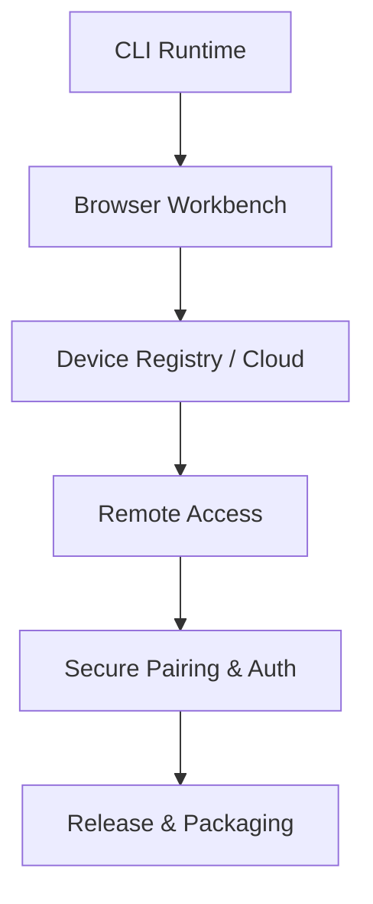
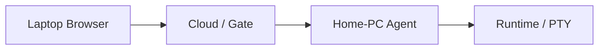

# TermBridge 产品路线图

## 产品目标

提供一套 **本地优先、可远程访问** 的 workspace runtime：

1. 在设备上快速启动可管理的会话（CLI / Shell / agent 等）。
2. 在浏览器工作台中管理设备、工作区、会话与终端。
3. 从其他设备安全访问本机 runtime（Agent 出站，无需入站端口）。
4. 终端、历史、重连、resize 等主路径在本地与远程下行为一致。
5. 在同一设备模型上提供代码工作台（浏览/编辑），与会话能力互补。

长期形态可以概括为：

## 当前重点

当前方向：**把「云端选设备 → 会话/终端 → 代码工作台」收成稳定、可日常使用的主路径**，并补齐远程场景下的可信度与安全边界。

已具备的能力基线（产品视角）：

- 本机 Agent + Runtime / PTY，会话与工作区模型。
- 浏览器会话工作台：工作区、会话管理、终端 attach / 历史。
- 云端账号、设备列表与路由；设备在线状态；离线设备绑定管理。
- 在线设备上的代码工作台（类 VS Code）。
- 本地开发与镜像/包交付等工程形态（细节见仓库构建说明）。

仍在加强：

- 多设备切换时状态隔离与失败提示的一致性。
- 真实 TUI（如 Claude Code / Codex）、大输出、长运行、中断等终端场景的可靠性。
- 经公网/反向代理的 WebSocket 与鉴权路径验证。
- 设备信任、配对、凭据轮换与更清晰的安全模型。
- 面向普通用户的安装、升级与文档。

## 阶段规划

不按历史里程碑编号展开，而按 **用户能获得什么** 划分。完成标准以「可演示的用户路径 + 可复查的验证」为准，而不是「代码合入即完成」。

### 阶段 A — 单设备工作台可靠

**目标**：本机或单设备路径下，会话工作台日常可用、状态可信。

| 结果 | 说明 |
| --- | --- |
| 工作台可预测 | 选中设备、在线状态、不可用原因表达清楚。 |
| 会话主路径稳定 | 创建、attach、历史、关闭/删除/重跑等操作可靠。 |
| 终端关键交互 | Shell / 常见 TUI、resize、中断在真实浏览器下可接受。 |
| 失败可理解 | 离线、鉴权、runtime 错误有明确反馈。 |

### 阶段 B — 云端多设备可用

**目标**：用户在浏览器中管理多台设备，并进入在线设备工作台。

| 结果 | 说明 |
| --- | --- |
| 设备列表与路由 | 在线/离线、进入会话/代码工作台路径清晰。 |
| 切换不串状态 | 换设备不污染 workspace / session / terminal 视图。 |
| 绑定可管理 | 离线设备解绑等管理动作安全、可撤销或可再绑定。 |
| 云端与本地语义一致 | 同一资源模型，不因入口不同而产生两套概念。 |

### 阶段 C — 远程访问 Beta

**目标**：人在其他网络时，经 Cloud 安全使用家里/办公室设备上的 runtime。

| 结果 | 说明 |
| --- | --- |
| Agent 出站隧道 | 设备无需入站端口即可保持可达。 |
| 远程终端主路径 | attach / 输入输出 / resize / 历史与本地一致。 |
| 信任与鉴权 | 用户—设备绑定、会话与 WebSocket 授权边界明确。 |
| 断线可恢复 | 断连、重连、路由不可用、token 失效有明确 UX。 |

**进入条件（建议）**：阶段 A 主路径稳定；阶段 B 多设备状态可信；安全边界（配对/凭据/授权）设计落地并可测。

### 阶段 D — 安全、打包与发布

**目标**：可被真实用户按文档安装使用，默认配置安全可用。

| 结果 | 说明 |
| --- | --- |
| 安全模型 | 威胁模型、默认暴露面、敏感数据边界成文且可执行。 |
| 发布物 | 可重复构建的安装包/便携包/镜像。 |
| 升级 | 配置与状态迁移、回滚策略清楚。 |
| 文档 | 安装、连接设备、远程访问、排障的最小用户文档。 |

## 优先级原则

1. **先单设备稳定，再多设备远程。**
2. **先工作台状态可信，再堆新表面。**
3. **先真实终端/TUI 验证，再承诺 Beta 可用。**
4. **先配对/凭据/授权设计，再扩大公网暴露。**
5. **每个阶段以可验证用户路径收口，而不是仅完成内部实现。**

## 近期不优先

以下方向有价值，但不抢当前主路径的带宽：

- 重型多人实时协作 / 企业多租户治理。
- 把 TermBridge 做成通用云端 CI 或完整云 IDE 替代品。
- 与主路径无关的边缘集成与过度配置项。

## 与产品设计的关系

资源模型、架构与体验原则见 [产品设计](./design.md)。  
本路线图只回答 **先做什么、后做什么、怎样算阶段完成**。