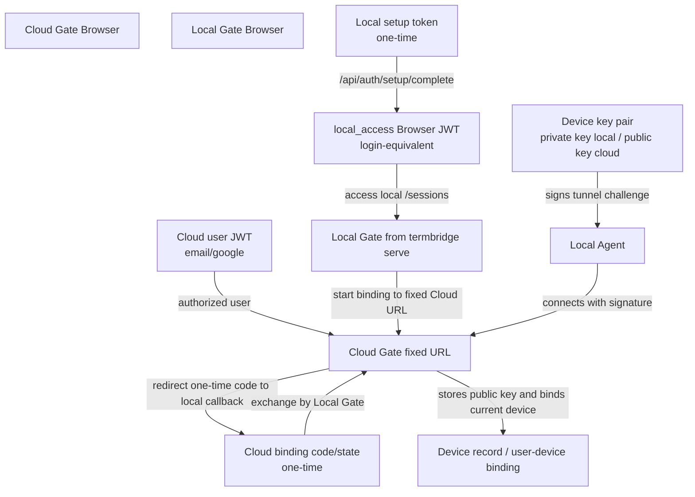
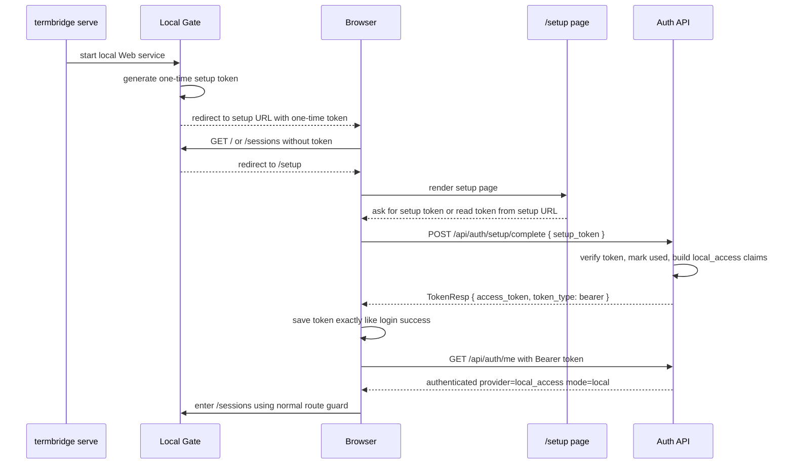
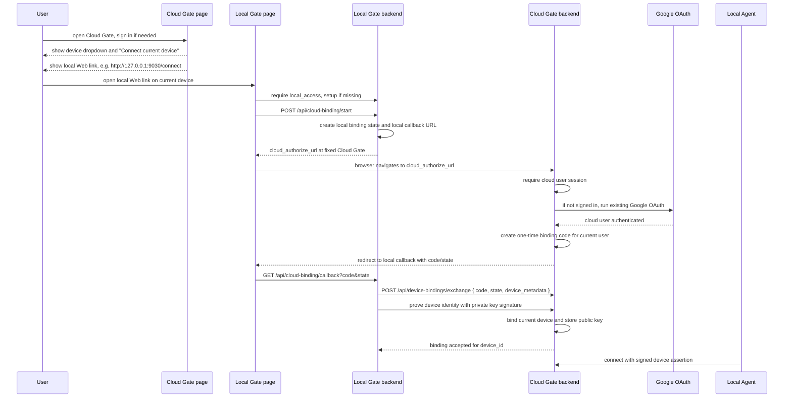
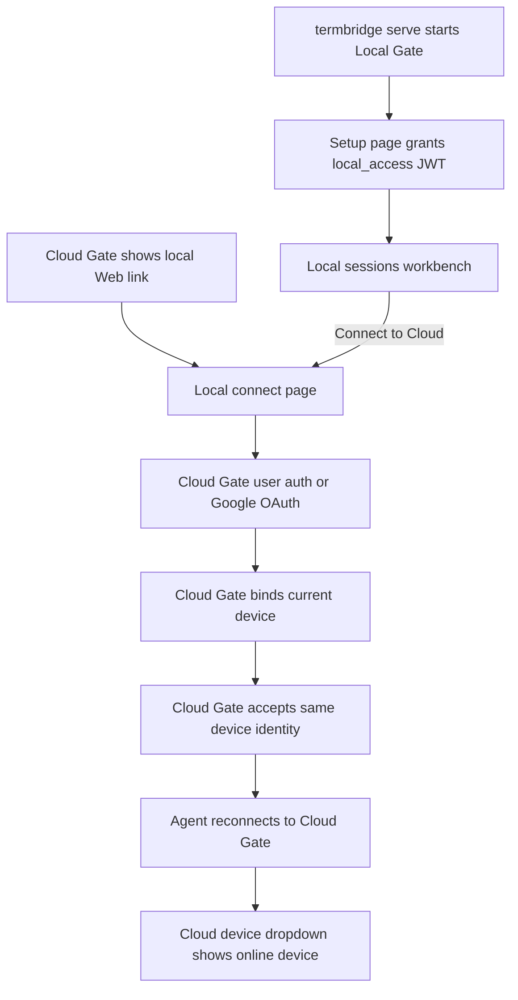

# 云端 Gate 设备绑定与本地 Agent 接入规格
最后修改时间: 2026-06-28 09:25:15

Review status: Accepted

## Flow mode / Stage

严格模式 / strict；规格 / Spec 已接受，当前进入计划 / Plan。

## Requirement basis

- Requirement: `docs/requirement/20260627-cloud-device-enrollment.md`
- Requirement status: Accepted

本 Spec 已根据用户在规格阶段的进一步反馈收敛，并因用户要求进入 Plan 标记为 Accepted：

1. `agent.listen_url` 是本地 Web 服务地址；`agent.connect_url` 是 Agent 要连接的 Gate 服务地址。二者可以相等，表示本地模式；`agent.connect_url` 也可以指向远程 / 云端 Gate，表示远程 Gate 模式。
2. 固定 Cloud Gate URL 配置名为 `cloud.gate_url`；Cloud 授权完成后回调本机的地址基准配置名为 `cloud.callback_base_url`，示例值为 `http://127.0.0.1:9030`。
3. 当前没有 GUI，但也**不新增新的 CLI 命令和入口**；第一版设备绑定通过 `termbridge serve` 已启动的本地 Web 服务页面完成。
4. 云端 Gate 页面展示本地 Web 服务链接，用户打开该本地页面后，在本地页面完成当前设备绑定流程。
5. 第一版只支持绑定**当前设备**；不支持从云端页面给另一台设备生成 token / 命令 / 二维码。
6. 未来 GUI 不要求用户输入 / 粘贴云端 Gate 地址；云端 Gate 是固定、已配置的地址。
7. 不实现高级 CLI / headless / env-only 绑定路径。
8. 设备列表以下拉菜单形态展示设备名和状态；离线设备不可选、不可切换。
9. 设备删除第一版只做云端记录简单删除；若设备当前在线则立即断开已有 Agent tunnel；用户可重新走绑定流程；不维护复杂 revoke tombstone 或“拒绝再次请求”的策略。
10. 本地模式采纳方案 A：未认证访问本地 Gate 时跳转 setup 页面；setup 页面用一次性 setup token 换取与 login 页面效果一致的 Browser 身份凭据，作为后续本地身份凭据。
11. 本地 setup 凭据不等于云端账号；从云端访问时绑定的是当前 device 到 cloud account，不做本地账号与云端账号合并，也不存在把本地模式“切换”为远程模式。
12. Spec 需要包含关键流程图。

## Overview

本规格把 TermBridge 设备绑定收敛为两个 Web 页面之间的授权交接：

```text
Cloud Gate page
  -> 用户已登录 cloud account
  -> 展示“连接当前设备”入口和本地 Web 服务链接
  -> 用户打开当前设备上的 Local Gate 页面

Local Gate page from termbridge serve
  -> setup 页面获取 local_access Browser 凭据
  -> 使用固定配置的 cloud Gate 地址发起 cloud binding
  -> 浏览器跳转到 Cloud Gate 完成用户确认 / Google 登录
  -> Cloud Gate 返回一次性 binding code 到 Local Gate callback
  -> Local Gate 证明当前 device identity，Cloud Gate 保存 public key 并建立 user-device binding
```

核心边界：

```text
Browser credential
  - 表示“当前 Browser 被允许访问这个 Gate”。
  - 云端：email / Google OAuth 登录后得到 user JWT。
  - 本地：setup token 换取 login 等效 JWT。

Setup / binding material
  - 表示一次性授权动作。
  - 本地 setup token：允许当前 Browser 获取本地访问凭据。
  - cloud binding code/state：允许当前设备绑定到 cloud user。

Device credential / device identity material
  - 表示“这台设备是谁”的长期设备材料。
  - 本机持有 private key；Cloud Gate 在绑定时保存对应 public key。
  - Agent 连接 Gate 时通过签名证明持有 private key。
  - 不等于 Browser JWT、Google token、email/password。
```

产品模型保持：

```text
User / Local access context
  -> Device
    -> Workspace
      -> Session
        -> Terminal
```

云端模式与本地模式使用同一心智模型，但入口不同：

| 场景 | Browser 凭据来源 | Device 凭据来源 | 用户输入 cloud 地址 | 是否创建独立本地账号 |
|---|---|---|---:|---:|
| 本地模式 / local Gate | setup 页面用 setup token 换取 login 等效 JWT | 当前本机 device identity + local Gate 授权材料 | 否 | 否 |
| 云端绑定当前设备 | Cloud Gate 登录 + Local Gate binding callback | 同一个本机 device identity 获得 Cloud Gate 授权材料 | 否，cloud 地址固定配置 | 否 |
| 从云端访问当前设备 | 先有 local_access，再通过本地 Web 页面连接固定 cloud Gate | 同一份设备长期身份材料：本机持有 private key，Cloud Gate 保存 public key 并记录 user-device binding | 否 | 否，绑定 device 而不是合并账号 |

> 配置语义澄清：`agent.listen_url` 表示 `termbridge serve` 启动的本地 Web 服务地址；`agent.connect_url` 表示 Agent 要连接的 Gate 服务地址。二者相等时表示本地模式；`agent.connect_url` 指向远程 / 云端 Gate 时表示远程 Gate 模式。按后续实现指令，`gate.listen_url` 不保留为 deprecated alias。

## Key flow diagrams

### 1. 整体身份材料关系



### 2. 本地模式 setup 页面获取 login 等效凭据



关键点：setup 完成后的前端行为必须复用 login 成功路径：保存 token、调用 `/api/auth/me`、进入受保护路由、WebSocket 使用同一 Browser token 机制。

### 3. 通过本地 Web 页面绑定当前设备到云端 Gate



关键点：第一版不需要新增 `termbridge device enroll` 命令。`termbridge serve` 已启动本地 Web 服务，所有交互从本地页面完成。

### 4. 本地访问与云端访问同一设备



关键点：不存在把本地模式切换为远程模式；打开 localhost 仍是本地访问，打开 Cloud URL 是云端访问。绑定对象是同一个当前 device identity；云端 user 来自 Cloud Gate 登录。

### 5. 设备列表下拉状态机

```mermaid
stateDiagram-v2
  [*] --> NoDevice: user has no bound device
  NoDevice --> BindingCurrentDevice: opens local Web link
  BindingCurrentDevice --> OnlineSelectable: binding complete and Agent connected
  OnlineSelectable --> Selected: user selects online device in dropdown
  Selected --> OfflineDisabled: Agent disconnects
  OfflineDisabled --> OnlineSelectable: Agent reconnects
  OnlineSelectable --> Deleted: user removes cloud record
  OfflineDisabled --> Deleted: user removes cloud record
  Deleted --> NoDevice: record removed; user can bind again
```



设备下拉要求：

- 在线设备可选。
- 离线设备显示名称和状态，但 disabled，不可选、不可切换。
- 删除设备只删除云端记录，回到可重新绑定状态。

## Design decisions

### 1. 不新增 CLI 绑定命令，复用 `termbridge serve` 本地 Web 服务

本规格不新增 `termbridge device enroll`、`termbridge agent enroll` 或 `serve --enroll`。

理由：

1. 当前 `termbridge serve` 已启动本地 Web 服务，用户可以在该页面完成本地 setup 和云端绑定。
2. Web 页面比新增 CLI 命令更接近未来 GUI 体验。
3. 云端 Gate 可以展示本地 Web 服务链接，引导用户回到当前设备完成绑定。
4. 第一版只绑定当前设备，不需要跨设备复制命令。

`termbridge serve` 仍是唯一需要用户启动的本地入口。

### 2. 云端 Gate 地址固定配置，不由用户粘贴

本地页面的“连接云端”使用固定配置的 cloud Gate 地址。配置名确定为：

```yaml
cloud:
  gate_url: https://gate.example.com
```

Cloud 授权完成后回调本机的地址基准使用单独配置：

```yaml
cloud:
  callback_base_url: http://127.0.0.1:9030
```

设计约束：

- 用户主路径不输入 / 粘贴 cloud Gate 地址。
- 未来 GUI 也读取同一固定配置，不提供 arbitrary Gate URL 输入作为主路径。
- `cloud.gate_url` 表示本地 Gate 发起绑定时要跳转 / 兑换的 Cloud Gate 地址。
- `cloud.callback_base_url` 表示 Cloud 授权完成后回调当前设备 Local Gate 的地址基准；实现使用其 scheme/host/port 构造 `/api/cloud-binding/callback`，它通常来自部署 / 本机默认配置，而不是 Cloud Gate 动态探测本机端口。
- `agent.connect_url` 仍表示当前运行实例中 Agent 的连接目标；打开 localhost 走本地配置，打开 `https://somewhere` 走远程 Gate 配置。第一版不把本地配置原地改成远程配置。
- 本地模式判定基于 `agent.connect_url` 与 `agent.listen_url`；“可连接的 cloud Gate 地址”需要单独表达，避免本地模式无法知道云端目标。

### 3. 本地 setup 凭据必须与 login 成功后的前端效果一致

本地 setup 不创建独立长期 local account/password，但它要产出与普通 login 一致的前端认证结果。

目标响应形态复用现有 `TokenResp`：

```json
{
  "access_token": "<jwt>",
  "token_type": "bearer"
}
```

JWT claims 推荐：

```json
{
  "sub": "local:<device_id>",
  "provider": "local_access",
  "email": "",
  "iat": 123,
  "exp": 456
}
```

`/api/auth/me` 返回示例：

```json
{
  "authenticated": true,
  "user": {
    "id": "local:<device_id>",
    "email": "",
    "display_name": "Local access",
    "provider": "local_access",
    "email_verified": false
  },
  "capabilities": {
    "mode": "local",
    "providers": ["local_setup"],
    "password_reset_enabled": false,
    "email_verification_enabled": false
  }
}
```

要求：

1. 前端保存 token 的代码路径应与 `authLogin` / `authGoogleCallback` 成功后相同。
2. Router guard、`initializeAuth()`、`/api/auth/me`、terminal WebSocket query token fallback 继续使用同一 Browser token。
3. UI 文案必须避免“创建本地账号”心智；推荐表达为“允许此浏览器访问本机 TermBridge”。
4. `local_access` 只在当前本地 Gate 语义下有效，不参与 cloud account linking。

### 4. 本地 setup token 是一次性材料，不是长期凭据

本地 Gate 在 local mode 下生成 setup token。该 token 用于换取 login 等效 Browser JWT。

规则：

- 高熵随机值，不能是短验证码。
- 短期有效，建议 10 分钟或当前 serve session 内有效。
- 使用后立即失效，或至少按 token id 标记 used。
- 服务端只保存 hash。
- 不写入普通 request log、error log 或 analytics。
- setup token 使用直接 URL token 形态传递；不实现终端 setup code、粘贴输入或 CLI fallback。

推荐 UX：本地 Gate 生成一次性 setup URL token，并通过本地 Web 页面跳转 / 引导用户确认；Cloud Gate 只使用 `cloud.callback_base_url` 派生的本地 callback，不承担本地 setup token 的生成与展示。

```text
TermBridge local setup

Open:
http://127.0.0.1:9030/setup?token=tb_setup_xxx

This one-time link grants local browser access to this computer and expires soon.
```

直接 URL token 路径不实现终端 setup code、粘贴输入或 CLI fallback；前端读取 token 后立即 `history.replaceState` 清除地址栏 token；setup 页面不得在无用户确认的情况下自动完成授权。本 feature 不把 request log redaction 作为实现范围。

### 5. 云端绑定使用 Cloud Gate 现有 Web OAuth，不要求 Desktop OAuth client

由于第一版设备绑定发生在本地 Web 页面与云端 Gate 页面之间，不新增 CLI OAuth 命令，所以不强制使用 Google Desktop OAuth client。

推荐第一版：

1. 本地页面跳转到固定 cloud Gate 的 device binding authorize URL。
2. Cloud Gate 使用现有 Web Google OAuth / email 登录完成用户认证。
3. Cloud Gate 生成短期 binding code。
4. Browser 被重定向回本地 loopback callback。
5. Local Gate 用 binding code 向 Cloud Gate 提交当前 device identity、public key 与签名 proof。

这样可以复用当前 cloud Gate 已有的 Google OAuth Web client，避免引入 Google Desktop OAuth client 配置。

Google Desktop OAuth client 仍作为未来可选方案：如果后续重新引入 CLI-only 或 native GUI direct OAuth，再使用系统浏览器 + Authorization Code + PKCE + loopback callback。

### 6. 第一版只绑定当前设备，不支持“另一台设备”流程

云端 Gate 的“添加设备”入口只引导用户打开当前浏览器所在机器上的本地 Web 服务链接。

不做：

- 为另一台设备生成 enrollment token。
- 展示跨设备复制命令。
- 二维码 / 邮件 / 远程 claim URL。
- headless server 绑定流程。

如果用户要绑定另一台设备，第一版要求用户在那台设备上运行 `termbridge serve`，并从那台设备的浏览器打开云端 Gate 与本地 Web 链接。

### 7. 本地 device 自动存在，但 Browser 凭据与 Agent 凭据仍要分离

本地模式下不要求用户理解 device enrollment。`termbridge serve` 应确保有稳定本机 device identity：

```yaml
agent:
  device_id: <stable-local-device-id>
  device_name: <hostname-or-user-name>
```

本地 setup 成功后，本机 device 可自动 claim 到 local access context。

长期目标：本地 Agent 连接 Gate 时使用同一份设备长期身份材料，不使用 Browser JWT 或 local access token。该设备材料以每台设备一组 key pair 为基础：private key 只在本机，public key 可在 cloud binding 时登记到 Cloud Gate。第一版如果实现成本需要拆分，可以分阶段：

1. setup 先产出 Browser login 等效凭据，保证本地页面认证闭环；
2. 紧随后续把 Agent tunnel Basic Auth 过渡为 device key 签名认证。

但 Spec 的目标模型必须保持：

```text
Browser credential != Device credential
```

### 8. 云端设备绑定以当前 device identity 为对象

本地 Web binding 应复用当前本地 device identity：

```text
agent.device_id
agent.device_name
hostname
platform
arch
agent_version
```

如果本地尚无 device id，则 `termbridge serve` 生成稳定 id 并写入本地配置 / state。

Cloud Gate 侧数据模型推荐第一版保持简单：

```text
devices
  id
  display_name
  hostname
  platform
  arch
  created_at
  updated_at
  last_seen_at

user_devices
  user_id
  device_id
  role              # owner initially
  created_at

device_keys
  id
  device_id
  public_key
  algorithm
  created_at
  last_used_at

cloud_binding_attempts
  id
  user_id
  state_hash
  local_callback_url
  device_hint
  status            # pending | completed | expired | failed
  expires_at
  completed_at
  created_at
```

不使用 `revoked_at` 作为第一版核心语义；删除设备时简单删除 binding / public key / device 相关云端记录。用户可重新绑定同一设备。

### 9. Agent tunnel 认证目标从用户凭据迁移到 device key 签名

基础用户系统文档中，Agent tunnel 仍临时复用 AuthService verifier。这里的“替换”不是因为当前代码立刻不能工作，而是因为该路径只适合作为基础用户系统阶段的过渡：它把“用户登录凭据 / local_admin shortcut”和“设备长期身份材料”混在一起，无法表达云端用户删除某台设备、某台设备重绑、Google 用户没有本地密码、以及一个用户有多台设备时的授权边界。

更准确地说：

- Browser AuthService verifier 回答“这个人是否能登录 / 访问 Web API”。
- Device verifier 应回答“这台 Agent / device 是否被允许连接 Gate”。
- 每台设备持有自己的 key pair；private key 只保存在本机，Cloud Gate 只保存 public key。
- cloud binding 后，Gate 需要能只让某个 device public key / binding 失效，而不是影响用户账号或要求保存用户密码。
- local setup 返回的 Browser JWT 也不应被 Agent 长期保存为连接凭据。

因此本 feature 的目标是把 Agent tunnel 从用户凭据迁移到 device key 签名认证；如果实现分阶段推进，Basic Auth 兼容只能作为短期过渡，不能作为设备绑定最终验收口径。

目标：

```text
Agent -> /api/agent/tunnel
X-TermBridge-Device-ID: <device_id>
X-TermBridge-Device-Timestamp: <unix_seconds>
X-TermBridge-Device-Nonce: <random_nonce>
X-TermBridge-Device-Signature: <signature>
```

签名内容应绑定 method、path、device_id、timestamp、nonce 和 Gate audience，避免把一次签名重放到其他接口或其他 Gate。

服务端校验：

1. 根据 `device_id` 查找已登记 public key。
2. 校验 signature。
3. 校验 timestamp / nonce，避免重放。
4. 查找 device 与 user binding 是否存在。
5. 更新 `last_used_at` / `last_seen_at`。
6. 将 tunnel 绑定到 device id。
7. Browser 路由请求必须再检查当前 Browser user 是否有权访问该 device。

删除设备时第一版可删除 public key / binding 记录；不维护单独拒绝列表。若 Agent 使用已删除 device public key 连接，因云端记录不存在自然失败即可，不额外实现拒绝策略或 tombstone。

### 10. 本地访问与云端访问不做账号合并，也不存在模式切换

本地模式 setup 得到的是 `provider=local_access` 的 login 等效凭据。它只解决本地 Browser 访问本机 Gate。

从云端访问当前设备时：

```text
local_access context
  -> user chooses Connect to Cloud in local page
  -> browser authenticates cloud user on fixed Cloud Gate
  -> existing local device_id and public_key bind to cloud user
  -> Cloud Gate accepts this device for the current cloud account
```

不做：

```text
local_access user + google user merge
```

也不做：

```text
local_access credential uploaded to cloud
```

也不存在把 localhost 本地配置切换成远程配置；打开 localhost 仍是本地访问，打开 Cloud URL 仍是云端访问。

### 11. 设备列表入口使用下拉菜单

Cloud Gate 登录后：

- 无设备：显示 empty state + “Connect current device”。
- 有设备：在主工作台入口 / header / session context 中展示设备下拉菜单。
- 下拉菜单直接展示设备名和状态。
- 在线设备可选。
- 离线设备 disabled，不可选、不可切换。
- 如果当前 selected device 变为 offline，应显示 offline 状态并阻止新的 session 操作；是否自动清空 selected device 进入 Plan。

本地 Gate setup 后：

- 本机 device 自动 selected。
- 进入 `/sessions`。
- UI 显示 local mode / current device。
- 提供 `Connect to Cloud` 入口，打开固定 cloud Gate 绑定流程。

### 12. 设备删除是简单云端记录删除

第一版删除设备不做复杂 revoke UX。

语义：

1. 删除 user-device binding。
2. 删除或失效对应 public key / device binding 记录。
3. 可删除 device 记录，或在没有任何 binding 时清理。
4. 不维护 revoked tombstone。
5. 不阻止同一设备重新绑定。
6. 不实现“拒绝该设备未来请求”的永久 deny 语义。

这符合用户要求：云端记录简单删除即可，用户可以重新走绑定流程。

## Interfaces

### Local setup APIs

```text
GET /setup
```

返回 SPA setup 页面。未认证访问本地 mode 的 `/`、`/sessions` 等受保护页面时，router guard 可跳转到该页面。

```text
GET /api/auth/setup/status
```

返回本地 setup 状态，不返回明文 setup token：

```json
{
  "mode": "local",
  "setup_available": true,
  "requires_token": true,
  "message": "Open the local setup link to grant this browser access."
}
```

```text
POST /api/auth/setup/complete
body: { "setup_token": "tb_setup_xxx" }
```

成功返回与 login 一致的 `TokenResp`：

```json
{
  "access_token": "<jwt>",
  "token_type": "bearer"
}
```

错误：

- `setup_token_invalid`
- `setup_token_expired`
- `setup_token_used`
- `setup_not_available`

### Local cloud binding APIs

本地 Web 页面入口：

```text
GET /connect
```

如果没有 `local_access`，先走 `/setup`。已有本地凭据后展示连接云端页面。

```text
POST /api/cloud-binding/start
Authorization: Bearer <local_access_jwt>
```

本地 Gate 生成 local binding state 和 local callback URL，并返回固定 Cloud Gate authorize URL：

```json
{
  "cloud_authorize_url": "https://gate.example.com/device-bindings/authorize?...",
  "expires_at": "2026-06-27T...Z"
}
```

本地 callback：

```text
GET /api/cloud-binding/callback?code=<binding_code>&state=<local_state>
```

本地 Gate 校验 state 后，向 Cloud Gate server-to-server 提交当前 device identity、public key 与签名 proof，让 Cloud Gate 接受这台设备并建立 user-device binding。

### Cloud binding APIs

Cloud authorize 页面 / endpoint：

```text
GET /device-bindings/authorize?callback=http%3A%2F%2F127.0.0.1%3A9030%2Fapi%2Fcloud-binding%2Fcallback&state=...
```

行为：

1. 要求 cloud Browser user 已登录；未登录则走现有 `/login` / Google OAuth。
2. 展示确认信息：将当前本地设备连接到当前 cloud account。
3. 生成短期 binding code。
4. redirect 回 local callback。

本地 Gate 兑换：

```text
POST /api/device-bindings/exchange
body: {
  "code": "tb_bind_...",
  "state": "...",
  "device": {
    "device_id": "...",
    "device_name": "...",
    "hostname": "...",
    "platform": "windows",
    "arch": "amd64",
    "public_key": "...",
    "key_algorithm": "ed25519",
    "proof": {
      "timestamp": 123,
      "nonce": "...",
      "signature": "..."
    }
  }
}
```

返回：

```json
{
  "user": {
    "id": "usr_...",
    "email": "leon@example.com",
    "display_name": "Leon",
    "provider": "google"
  },
  "device": {
    "id": "dev_...",
    "name": "DESKTOP-5C03B03"
  },
  "binding": {
    "accepted": true
  }
}
```

Cloud Gate 不签发新的长期 device token；它保存当前 device 的 public key，并用该 public key 验证后续 Agent tunnel 的签名 assertion。private key 始终只保存在本机。

### Device dropdown API

`/api/devices` 返回当前 user / local access context 可访问设备。当前实现中的 `DeviceRegistry` 是运行时内存里的在线连接表：Agent tunnel hello 成功后注册，断开后标记 offline；它不是持久化授权表。Plan 中所谓 local registry 指的就是这个运行时连接表。第一版本地 `provider=local_access` 场景只返回当前本机 local device，数据来源可以由稳定 device identity + runtime registry 合成；云端用户场景则按 `user_devices` 授权表过滤，再叠加 runtime registry 的在线状态。

```json
[
  {
    "id": "dev_...",
    "name": "DESKTOP-5C03B03",
    "online": true,
    "status": "online",
    "last_seen": "2026-06-27T...Z"
  },
  {
    "id": "dev_...",
    "name": "MacBook-Pro",
    "online": false,
    "status": "offline",
    "last_seen": "2026-06-27T...Z"
  }
]
```

前端规则：

- `online=true` 可选。
- `online=false` disabled。
- 不能切换到离线设备。

### Device delete API

```text
DELETE /api/devices/{device_id}
Authorization: Bearer <cloud_user_jwt>
```

第一版语义：删除当前 user 对该 device 的云端绑定和相关 public key 记录；不创建 revoked tombstone。同一设备可重新绑定。如果该设备当前存在在线 Agent tunnel，删除成功后立即关闭对应 tunnel、关闭关联 terminal relay，并把运行时在线状态标记为 offline；如果设备已离线，则删除记录即可。

### Device-authenticated tunnel

接口：

```text
GET /api/agent/tunnel
X-TermBridge-Device-ID: <device_id>
X-TermBridge-Device-Timestamp: <unix_seconds>
X-TermBridge-Device-Nonce: <random_nonce>
X-TermBridge-Device-Signature: <signature>
```

签名由本机 private key 生成，Cloud Gate 使用已保存的 public key 验证。签名内容必须覆盖 method、path、device_id、timestamp、nonce 与 Gate audience。

### Config / local state

固定 cloud Gate 地址与云端展示本地链接配置：

```yaml
cloud:
  gate_url: https://gate.example.com
  callback_base_url: http://127.0.0.1:9030
```

现有 Agent 连接配置仍表达实际连接目标：

```yaml
agent:
  connect_url: https://gate.example.com
  device_id: dev_...
  device_name: DESKTOP-5C03B03
```

本地 setup token、local binding state 与设备长期身份材料都放在 runtime state dir（默认 `.termbridge`）下，而不是普通 YAML 配置。private key 不建议长期明文放在普通 YAML。第一版可在 state dir 下保存，并标注文件权限要求：

```text
.termbridge/
  setup-tokens.json              # one-time setup token hash / expiry / used state
  cloud-binding-attempts.json    # local state hash / callback / expiry / exchange result
  devices/<device_id>/device.json
  devices/<device_id>/private_key.pem   # local-only device private key; future OS keychain
  devices/<device_id>/public_key.pem    # public key registered with Cloud Gate
```

如果第一版必须放入配置文件，Plan / Verification 必须明确风险和后续迁移项。长期可迁移 private key 到 OS keychain / GUI secure storage；但第一版状态目录是明确落点。

## Affected components

### Backend

- `internal/infrastructure/config/config.go`
  - 区分 local / remote mode 基于 `agent.connect_url` 与 `agent.listen_url`。
  - 新增固定 cloud Gate URL 配置。
  - 新增或规划 device key storage 配置。

- `internal/application/auth/*`
  - 增加 local setup token -> login-equivalent TokenResp 流程。
  - 增加 `provider=local_access` claims / me response 语义。

- `internal/application/device` 或等价新 package
  - 管理 cloud binding attempts、device key pair、user-device bindings。

- `internal/infrastructure/repository/auth` 或新 repository
  - 持久化 devices、user_devices、device_keys、setup_tokens / cloud_binding_attempts。

- `internal/transport/http/gatewayapi/*`
  - 新增 setup auth endpoints。
  - 新增 local cloud-binding endpoints。
  - 新增 cloud device-binding authorize / exchange endpoints。
  - Agent tunnel 认证从用户凭据迁移到 device key 签名。
  - `/api/devices` 按当前 Browser user/local_access context 过滤。
  - `DELETE /api/devices/{device_id}` 简单删除绑定记录。

- `internal/application/agent/client.go`
  - 支持从 local state 读取 device private key。
  - 使用 device key 签名连接 Gate。

### Frontend

- `web/src/router/index.ts`
  - local mode 未认证时跳转 `/setup`。
  - setup 成功后进入普通 auth 初始化路径。

- `web/src/views/SetupView.vue`
  - 新增 setup 页面。
  - 只接收直接 URL token，不提供终端 setup code / 粘贴输入 / CLI fallback。
  - 调用 `authSetupComplete`，保存 TokenResp。
  - 清理 URL 中的 token。

- `web/src/views/ConnectCloudView.vue` 或等价组件
  - 本地页面的“连接云端”流程。
  - 展示固定 cloud Gate 目标。
  - 调用 local `/api/cloud-binding/start`。
  - 处理 cloud redirect 回来的结果展示。

- `web/src/features/gateway/api.ts`
  - 新增 setup status / complete API client。
  - 新增 cloud binding start / callback result API client。
  - 扩展 device list / delete API。

- `web/src/store/gateway.ts`
  - 复用 login 成功保存 token / initializeAuth 逻辑。
  - 支持 `provider=local_access` user display。
  - 支持 device dropdown 选中在线设备、禁用离线设备。

- 登录 / 首页 / Sessions
  - 本地 setup 后显示 local mode / current device。
  - 云端登录后展示 device empty state 或 device dropdown。
  - 离线设备不可选、不可切换。

### Docs / config examples

- `.env.example`
  - 固定 cloud Gate URL 示例。
  - 本地 setup 与 cloud binding 示例。

- README
  - 本地 setup 流程。
  - 通过本地 Web 页面连接 Cloud Gate 的流程。
  - device key 与 Browser credential 边界。

## Technical questions resolved in Spec

1. **本地模式是否需要认证？**
   - 需要。不能把本地 HTTP 端口视为天然可信。

2. **本地模式如何避免第二套账号？**
   - 使用 setup token 换取 `provider=local_access` 的 login 等效 Browser JWT；不要求创建 local owner/password。

3. **setup 页面得到的凭据是什么？**
   - 与 login 页面效果一致的 `TokenResp`，前端保存与恢复路径相同。

4. **当前无 GUI 是否需要新增 CLI enrollment 命令？**
   - 不需要。复用 `termbridge serve` 启动的本地 Web 服务页面完成绑定。

5. **是否支持绑定另一台设备？**
   - 第一版不支持。只绑定当前设备。

6. **云端 Gate 地址如何提供？**
   - 固定配置，不要求用户输入 / 粘贴。

7. **从云端访问当前设备是否合并账号？**
   - 不合并。Cloud binding 只把当前 device identity / public key 绑定到 cloud user，不合并 local_access 与 cloud account，也不存在模式切换。

8. **Agent 长期用什么连接 Gate？**
   - 设备长期 key pair：Agent 持有 private key 并对 tunnel 请求签名；Gate 保存 public key 并验签。它不是 Browser JWT、Google token 或用户密码。

9. **离线设备如何展示？**
   - 设备下拉展示离线状态，但 disabled，不可选、不可切换。

10. **设备撤销如何做？**
    - 第一版简单删除云端记录；允许重新绑定；不维护复杂拒绝策略；若该设备当前在线，则立即断开已有 Agent tunnel。

## Plan decisions captured from user review

1. 固定 Cloud Gate URL 配置名确定为 `cloud.gate_url`。
2. Cloud 授权完成后回调本机的地址基准配置名确定为 `cloud.callback_base_url`，示例值为 `http://127.0.0.1:9030`。
3. setup token 只支持直接 URL token，由本地生成一次性 setup URL；不实现终端 setup code、粘贴输入或 CLI fallback。
4. `local_access` JWT TTL 与刷新策略进入 Plan 解释：第一版沿用 `auth.jwt_ttl` 或设置同量级短期 TTL，不引入 refresh token；过期后重新走 setup token。
5. 本地 setup token / cloud binding attempts 存储在 runtime state dir（默认 `.termbridge`）下，保存 hash、过期时间和 used/completed 状态。
6. device credential 第一版定义为设备长期 key pair：private key 只保存在 `.termbridge/devices/<device_id>/private_key.pem`，public key 可在 Cloud Gate 绑定时登记；OS keychain 作为未来迁移方向。
7. Agent tunnel 采用 device key 签名认证，使用 `X-TermBridge-Device-ID`、timestamp、nonce、signature 等 header，避免与 Browser Bearer JWT 混淆。
8. 第一版应把 Agent tunnel 迁移到 device key 签名认证；如实现中必须拆分，Plan 必须把“Browser setup / Cloud binding 已完成但 tunnel 仍复用旧 Basic Auth”的状态列为不可最终验收的过渡风险。
9. `/api/devices` 对 `provider=local_access` 返回当前本机 local device；当前实现中的 `DeviceRegistry` 只是运行时在线连接表，不是新的产品授权概念。
10. 删除设备时，如果设备当前在线，立即断开已有 Agent tunnel；如果离线，则删除云端记录并等待下一次连接因 public key / binding 不存在而失败。

## Alternatives considered

### Alternative A：新增 `termbridge device enroll` CLI 命令

拒绝为第一版主路径。

原因：用户明确指出 `termbridge serve` 后已有本地 Web 服务，可以在页面完成绑定，无需添加新的 CLI 命令和入口。

### Alternative B：绑定另一台设备

拒绝进入第一版。

原因：用户明确要求只能绑定当前设备。另一台设备应在那台设备上运行 `termbridge serve` 并打开本地 Web 页面完成自己的绑定。

### Alternative C：未来 GUI 输入 / 粘贴云端 Gate 地址

拒绝为主路径。

原因：云端 Gate 是固定配置好的地址。GUI 未来应读取配置，不要求用户输入任意地址。

### Alternative D：高级 CLI / env-only / headless 绑定

拒绝进入第一版。

原因：用户明确要求不实现 Scenario 5。第一版只做本地 Web 页面当前设备绑定。

### Alternative E：本地 first-run 创建 local owner/password

不采用为默认主路径。

原因：用户明确不希望搞出多套账号。local owner/password 容易变成与 cloud Google/email account 并列的第二套身份，并制造未来合并问题。

可以保留为离线保护 / advanced setting，但不是默认 setup path。

### Alternative F：本地模式完全免认证

拒绝。

原因：本地 terminal/session 能力风险高，本地端口也可能被恶意网页、同机进程或误配置网络访问滥用。至少需要 setup token -> Browser JWT 的认证边界。

### Alternative G：设备删除维护 revoked tombstone / deny list

暂不采用。

原因：用户明确要求云端记录简单删除即可，用户可以重新走绑定流程，无须拒绝请求。后续若需要审计和强撤销，可再引入 revoked 状态。

## Risks

1. **setup token 泄露风险**：如果 setup token 出现在 URL、request log、浏览器历史或错误日志中，会直接授予本地 Browser 访问权。
2. **local_access 误解风险**：如果 UI 文案不清楚，用户可能以为 setup 创建了另一个 TermBridge 账号。
3. **local callback 风险**：Cloud Gate redirect 到 localhost callback 时必须校验 state，并且只允许 loopback callback；否则可能被恶意本机页面或错误地址滥用。
4. **device private key 存储风险**：第一版若 private key 明文写入文件，需要文件权限和后续迁移计划。
5. **过渡实现风险**：如果 Agent tunnel 继续使用用户凭据，而 Browser 已使用新模型，会出现模型不一致。
6. **本地 / 远程访问边界风险**：本地 Gate 与远程 Gate 是不同访问入口；打开 localhost 走本地，打开 Cloud URL 走远程。第一版不应引入 profile 或“切换模式”心智；Cloud binding 只让 Cloud Gate 接受当前 device identity / public key，不破坏本地访问。
7. **日志风险范围说明**：基础 auth verification 已记录普通 request log 仍可能泄露 token；用户已明确本 feature 不做敏感字段 redaction 专项，因此该问题保留为基础 auth 后续项，不作为本 feature 实现前置。
8. **用户-device 授权风险**：Cloud `/api/devices` 必须按当前 user 过滤；否则设备绑定会变成全局设备列表。
9. **本地 Web 链接可达性风险**：云端页面展示的本地链接假设用户当前设备已运行 `termbridge serve` 且监听默认/配置端口；非默认端口或服务未运行时需要清晰提示。
10. **简单删除风险**：不维护 revoke tombstone 会降低审计和强撤销能力；第一版接受该限制，但必须记录为后续增强点。

## User review notes

用户关键反馈已纳入本 Spec：

1. 用户澄清：`agent.listen_url` 是本地 Web 服务地址，`agent.connect_url` 是 Gate 服务地址；二者可以相等表示本地模式，也可以由 `agent.connect_url` 指向云端表示远程 Gate 模式。
2. 当前本地已经可以通过 `TERMBRIDGE_AGENT__CONNECT_URL` 连接远程 Gate，设计应复用而不是重做。
2. 未来会有 GUI，但当前没有 GUI。
3. 采纳类似 VS Code 的授权码思路曾作为候选，但在本轮进一步收敛后，第一版不新增 CLI OAuth 命令，而是通过 `termbridge serve` 本地 Web 页面完成绑定。
4. 本地模式连接本地 Gate 也需要认证，但不能创建第二套长期账号。
5. 采纳方案 A：本地模式跳转 setup 页面，在 setup 页面得到与 login 页面效果一致的凭据，作为后续身份凭据。
6. 用户明确修正：当前无 GUI 也不添加新 CLI 命令；`termbridge serve` 后已有本地 Web 服务，绑定流程都在页面完成。
7. 用户明确修正：第一版用户只能绑定当前设备；云端 Gate 展示本地 Web 服务链接，由本地页面完成所有绑定流程。
8. 用户明确修正：未来 GUI 不支持用户输入 / 粘贴云端 Gate 地址；云端 Gate 是固定配置好的。
9. 用户明确修正：不实现高级 CLI / 环境变量绑定路径。
10. 用户明确修正：设备列表下拉菜单直接展示设备名和状态；离线设备不可选、不可切换。
11. 用户明确修正：设备删除只做云端记录简单删除；用户可重新走绑定流程，无须复杂拒绝策略；若设备当前在线则断开连接。
12. 用户进一步确认：固定 Cloud Gate URL 配置为 `cloud.gate_url`；Cloud 授权完成后回调本机的地址基准配置调整为 `cloud.callback_base_url`，示例 `http://127.0.0.1:9030`。
13. 用户进一步确认：device credential 可以是设备长期材料；Cloud binding 只是让 Cloud Gate 接受这台设备。第一版采用每台设备一组 key pair：private key 留在本机，Cloud Gate 保存 public key。
14. 用户进一步确认：不引入 `cloud profile` / `remote connection profile` 等概念；只有一份配置，serve 启动后打开 localhost 是本地访问，打开 Cloud URL 是云端访问，不存在“切换”模式。
15. Spec 必须包含关键流程图；本文已包含身份材料关系、本地 setup、本地 Web 绑定当前设备、本地与云端访问同一设备、设备下拉状态机等流程图。
