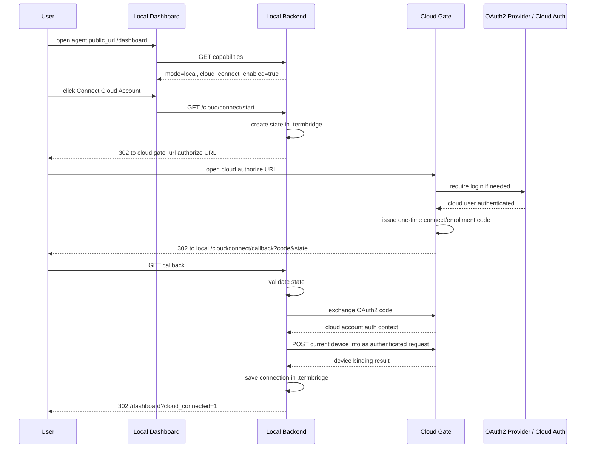
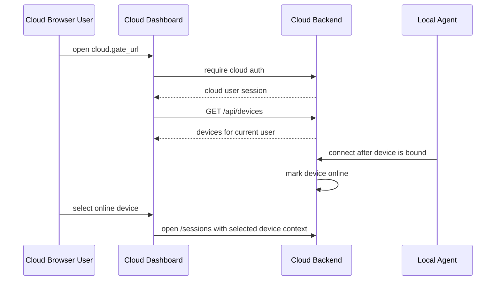

# Cloud / Local 模式分离与本机设备云端绑定规格
最后修改时间: 2026-06-28 20:08:47

Review status: Accepted

## Flow mode / Stage

严格模式 / strict；规格 / Spec 已接受，当前进入计划 / Plan。

## Requirement basis

- Requirement: `docs/requirement/20260628-cloud-local-mode-enrollment.md`
- Requirement status: Accepted

本 Spec 基于用户进入 Spec 前确认的关键决策：

1. web runtime mode 配置名采用 `web.mode: local|cloud`。
2. `/dashboard` 使用一个 `DashboardView`，根据 mode 渲染 local / cloud 两种语义。
3. 本地连接云端账号入口采用 `/cloud/connect/start`。
4. OAuth2 authorize / callback / token exchange endpoint 形态应优先遵循 OAuth2 库、OAuth2 标准和主流实践，不手造非标准 OAuth2 协议。
5. 本轮采用“先有 cloud account，再由已认证普通请求上报设备”的模型；不引入 device credential、公钥私钥或 possession proof 作为本阶段必需设计。
6. 设备绑定状态和本地 cloud connection 状态保存到 state dir，即现有 `.termbridge` 状态目录。
7. 旧 setup token / local_access 主路径移除，不向后兼容；实现完成后直接删除，删除引发的问题在实现阶段逐项修复。
8. local mode 只要配置满足即可发起流程；配置不正确时云端 OAuth2 / callback / exchange 不会通过，并应给出可理解错误。
9. 本轮优先完成本地 web OAuth2 认证；CLI PKCE desktop flow 和未来 GUI deep link 作为后续扩展。

## Overview

本规格把 TermBridge Web 运行时明确拆成两个 mode：

```text
web.mode = local
  -> 本机 Agent 控制台
  -> 打开 agent.public_url 进入 /dashboard
  -> 不提供本地账号登录 / 注册 / 找回密码
  -> 右上角账号 UI 表示 cloud connection 状态
  -> 点击“连接云端账号”后打开 cloud.gate_url 的 OAuth2 授权流程
  -> 授权完成后返回 agent.public_url
  -> local backend 继续上报 device info 完成绑定

web.mode = cloud
  -> 云端 Gate 门户
  -> 提供账号登录 / 注册 / 找回密码 / Google OAuth
  -> 登录后进入 /dashboard
  -> 展示当前 cloud user 可访问设备
  -> 选择 online device 进入 /sessions
```

关键收敛：

- `web.mode` 是 web auth / UI 能力开关。
- `agent.connect_url` 是 Agent tunnel 目标，不再决定 web 是否需要账号登录。
- `cloud.gate_url` 是 local mode 发起云端连接的远端 Gate 地址。
- 本地 web OAuth2 认证是本轮第一优先级：先让 local dashboard 可以打开 cloud gate 完成 cloud account auth 并回到 localhost。
- 本轮设备上报采用 cloud account 认证后的普通请求模型：用户完成 OAuth2 登录后，local backend 使用云端认证结果向 cloud gate 上报当前设备信息；暂不引入 device credential、公钥私钥或 possession proof。

## Design decisions

### 1. 显式 web.mode

新增或正式化配置：

```yaml
web:
  mode: local # local | cloud
```

建议默认值：

```text
local
```

原因：

- 本地开发 / 用户本机运行 `termbridge serve` 是默认场景。
- 云端部署必须显式设置 `web.mode=cloud`，避免本地用户误入 cloud auth gate。
- 不能再通过 `agent.connect_url == agent.listen_url` 推导 web mode，因为本机 Agent 可以同时运行 local web 并连接远端 cloud gate。

环境变量建议：

```text
TERMBRIDGE_WEB__MODE=local|cloud
```

校验规则：

- 只接受 `local` 或 `cloud`。
- 空值使用默认 `local`。
- 非法值启动失败并报告配置错误。

### 2. Dashboard 采用单页面 mode 分支

用户已确认不拆 `LocalDashboardView` / `CloudDashboardView`，采用一个 `DashboardView` 按 mode 渲染。

页面结构建议：

```text
DashboardView
  -> 读取 gateway capabilities / mode
  -> mode=local 渲染 Local Dashboard section
  -> mode=cloud 渲染 Cloud Dashboard section
```

Local dashboard 关注：

- 本机设备名称 / 状态。
- 本机 workspace/session 入口。
- Cloud Gate 配置状态。
- 右上角 cloud account connection UI。
- “连接云端账号”主操作。
- OAuth2 返回 / enrollment 失败提示。

Cloud dashboard 关注：

- cloud user 当前登录状态。
- 当前用户设备列表。
- 空设备状态。
- online/offline 状态。
- 进入 `/sessions` 的入口。

避免混淆规则：

- local mode 不展示 email 登录、注册、找回密码表单。
- cloud mode 不展示“本机 workspace 直接访问”的语义。
- 同一个页面可以复用样式和组件，但文案必须明确当前是“本机 TermBridge”还是“云端 TermBridge”。

### 3. 前后端都按 local / cloud mode 组织逻辑

用户补充确认：web 和后端均基于 local/cloud 模式组织逻辑，基于环境变量组织镜像构建。

设计含义：

- `web.mode` 是前端路由、页面渲染、账号 UI、API 调用策略的核心分支。
- `web.mode` 也是后端 auth middleware、API 暴露能力、启动提示和云端连接能力的核心分支。
- 同一套镜像 / 二进制可以部署为 local 或 cloud；部署时通过环境变量决定 mode。
- 镜像构建不应产出两套前端或两套后端；差异由运行时配置驱动。

环境变量：

```text
TERMBRIDGE_WEB__MODE=local|cloud
```

云端部署示例：

```text
TERMBRIDGE_WEB__MODE=cloud
TERMBRIDGE_CLOUD__GATE_URL=http://termbridge.lvh.me
```

本地默认：

```text
TERMBRIDGE_WEB__MODE=local
```

前端组织：

- 路由 guard 根据 capabilities / mode 决定是否要求 cloud auth。
- `DashboardView` 根据 mode 渲染 local 或 cloud section。
- 账号 UI 根据 mode 表达 cloud connection 或 cloud user session。
- local mode 不展示账号注册 / 找回密码主路径。

后端组织：

- Auth middleware 必须识别 local mode。
- local mode 对本机 dashboard / sessions 所需 API 放行，不要求 Browser JWT。
- cloud mode 对 cloud dashboard / sessions / devices 等受保护 API 要求 cloud user auth。
- local-only API，例如 `/cloud/connect/start`，只在 local mode 有效。
- cloud-only API，例如账号注册 / 找回密码，只在 cloud mode 有效。

### 4. 账号能力只在 cloud mode 激活

后端 capabilities 应表达：

```json
{
  "mode": "local" | "cloud",
  "providers": [...],
  "features": {
    "account_auth": true | false,
    "cloud_connect": true | false,
    "local_workbench": true | false
  }
}
```

第一版可不引入完整 `features` 对象，但前后端至少必须能区分：

- `mode=local`：前端不要求认证即可进入 dashboard / 本机 workbench；账号 UI 显示 cloud connection。
- `mode=cloud`：受保护路由需要 cloud user auth；账号 UI 显示 cloud user。

后端路由策略：

| 路由能力 | local mode | cloud mode |
|---|---:|---:|
| `/dashboard` | 可直接访问 | 需要 cloud auth 后访问 |
| `/sessions` | 可直接访问本机能力 | 需要 cloud auth + selected device |
| `/login` | 非主入口，提示去 cloud gate 或回 dashboard | 正式账号登录页 |
| 注册 / 找回密码 | 不提供 | 提供 |
| Google OAuth 登录 | 不作为 localhost 登录表单提供 | 提供 |
| `/cloud/connect/start` | 提供 | 不作为主路径，必要时返回错误或重定向 dashboard |

### 5. `/cloud/connect/start` 是本地连接云端入口

入口语义：

```text
GET /cloud/connect/start
```

运行位置：local backend。

职责：

1. 校验当前 `web.mode=local`。
2. 校验 `cloud.gate_url` 已配置。
3. 准备 local OAuth2 / enrollment state。
4. 生成 cloud gate authorize URL。
5. 将浏览器重定向到 cloud gate。

建议 query 参数：

```text
GET /cloud/connect/start?redirect=/dashboard
```

其中 `redirect` 是 local callback 完成后的本地前端落点，只允许安全相对路径。

本地生成 state 时应绑定：

- 随机 state nonce。
- local callback URL。
- local post-auth redirect。
- device id。
- device id 与本机 device metadata。
- cloud.gate_url。
- 过期时间。

state 保存位置：state dir，即现有 `.termbridge` 状态目录。

### 6. OAuth2 endpoint 与 client config 设计

用户确认：authorize endpoint 与 exchange endpoint 应由 OAuth2 库、OAuth2 标准或主流实践决定，而不是在产品层手造一套非标准命名。

本 Spec 将其收敛为：

- 后端使用 OAuth2 library 的标准 client config 管理授权 URL 与 token exchange。
- 授权端点、token 端点、redirect URI、scope、state 等字段遵循 OAuth2 库和 provider metadata / config。
- TermBridge 产品层只定义“local web 发起 cloud account authorization 并在 callback 后上报设备”的业务语义。
- 不把 `/cloud/connect/start` 当成 OAuth2 标准 authorize endpoint；它只是 local backend 的产品入口，内部通过 OAuth2 config 生成标准 authorize URL。

建议抽象：

```go
type CloudOAuthClient interface {
    AuthCodeURL(state string, opts ...oauth2.AuthCodeOption) string
    Exchange(ctx context.Context, code string, opts ...oauth2.AuthCodeOption) (*oauth2.Token, error)
}
```

选取的 OAuth2 库：

```text
golang.org/x/oauth2 v0.36.0
```

选取理由：

- 当前项目 `go.mod` 已通过现有 Google OAuth 代码间接引入 `golang.org/x/oauth2 v0.36.0`。
- 现有 `internal/application/auth/service.go` 已使用 `oauth2.Config`、`google.Endpoint`、`AuthCodeURL` 和 `Exchange` 实现 Google OAuth。
- 本轮 local web -> cloud gate OAuth2 可以复用同一套标准库抽象，避免新增第二套 OAuth2 依赖。
- 实现阶段应把该依赖提升为直接依赖，如果新增代码直接 import `golang.org/x/oauth2`。

关键边界：

- localhost callback 不接收 Google token。
- OAuth2 token exchange 发生在后端。
- 设备上报使用后端获得的 cloud account authentication context 进行普通认证请求。
- 本阶段不设计 device credential、公钥私钥或 possession proof。

### 7. 本地 OAuth2 callback

建议 local callback 路由：

```text
GET /cloud/connect/callback?code=...&state=...
```

运行位置：local backend。

职责：

1. 从 state dir 读取并校验 state。
2. 校验 state 未过期、未使用、匹配当前 cloud.gate_url 与 callback。
3. 用 code 调用 cloud gate 完成 exchange。
4. 保存 cloud account connection 摘要。
5. 使用 cloud account authentication context 上报当前设备信息。
6. 重定向回 local dashboard，并通过 query 或本地状态展示成功 / 失败。

失败处理：

- state missing：提示连接请求不存在或已过期。
- state mismatch：提示安全校验失败。
- cloud exchange 失败：提示云端授权失败或配置错误。
- cloud.gate_url 不可达：提示网络或 Gate 配置问题。
- 设备上报失败：提示云端未接受当前设备绑定。

### 8. Cloud account 认证后的设备上报

用户确认：本轮先有账号后报设备，看起来可以使用普通请求和认证，不需要引入 device credential、公钥私钥设计。

本阶段完整目标流程调整为：

```text
Local dashboard
  -> GET local /cloud/connect/start
  -> local backend 使用 OAuth2 config 生成标准 authorize URL
  -> browser redirect cloud OAuth2 authorize URL
  -> cloud login / OAuth2
  -> redirect local /cloud/connect/callback?code&state
  -> local backend 使用 OAuth2 config exchange code
  -> local backend 获得 cloud account authentication context
  -> local backend POST cloud gate 上报当前设备信息
  -> cloud gate 基于已认证用户创建 user-device binding
  -> local backend 保存 cloud connection / bound account / gate metadata 到 state dir
```

设备上报 request 建议：

```json
{
  "device": {
    "id": "device-id",
    "name": "device-name"
  },
  "agent": {
    "public_url": "http://localhost:9031",
    "connect_url": "http://termbridge.lvh.me"
  }
}
```

设备上报 response 建议：

```json
{
  "device_id": "device-id",
  "gate_url": "http://termbridge.lvh.me",
  "account": {
    "display_name": "...",
    "email": "..."
  },
  "bound_at": "..."
}
```

边界：

- 本阶段不生成 device credential。
- 本阶段不生成或上报 public key。
- 本阶段不要求 possession proof。
- 后续如果需要设备级长期凭据、撤销、rotation 或 Agent 免用户态连接，再开启新需求补充 device credential 设计。

### 9. State dir 存储

用户确认保存位置为 state dir，即当前 `.termbridge`。

建议逻辑结构：

```text
.termbridge/
  device.json 或 device.yaml
  cloud/
    connection.json
    enrollments/
      <state>.json
```

存储内容分类：

```text
Device identity:
  - device_id
  - device_name

Cloud connection:
  - gate_url
  - account display info
  - bound device id
  - connected_at
  - last_error

Pending OAuth2/connect state:
  - state nonce hash / id
  - callback URL
  - post-auth redirect
  - cloud.gate_url
  - expires_at
  - used_at
```

安全要求：

- 若保存 OAuth2 token 或其他 secret，文件权限应尽可能限制当前用户读取。
- request log 不记录 code、state、token 全量值。
- pending state 应短期过期，成功或失败后清理或标记 used。

### 10. 移除 setup token / local_access 主路径

用户确认：已有 setup token / local_access 主路径移除，不向后兼容；实现完成后直接删除，有问题解决问题。

Spec 层含义：

- Local mode 不再通过 setup token 换取 local_access browser credential 才能访问 dashboard。
- `/setup` 不再是本机首次访问主路径。
- `/api/auth/setup/*` 不再作为正式产品路径。
- 旧测试、文档和前端路由需要在 Plan / Implementation 阶段删除或改写。

迁移策略：

- 不提供旧 local_access token 自动迁移。
- 若浏览器已有旧 local_access token，前端应忽略或清理，不影响进入 local dashboard。
- 删除旧路径后如果测试或调用点暴露依赖，Implementation 阶段按新模型修复，不增加兼容桥接。

### 11. Local mode 配置错误处理

用户确认“local mode 满足配置即可，不正确的配置云端 OAuth2 不会过”。

Spec 落地为：

- local backend 不需要为所有 cloud OAuth2 错误做复杂预检。
- 但必须在用户可见处反馈失败原因的大类。
- 配置错误不应表现为空白页面或无限 redirect。

错误分类：

| 错误 | 用户反馈 |
|---|---|
| `cloud.gate_url` 缺失 | 未配置云端 Gate 地址 |
| `cloud.gate_url` 非法 | 云端 Gate 地址无效 |
| cloud gate 不可达 | 无法连接云端 Gate |
| redirect URI 不被云端接受 | 云端 OAuth2 回调配置不匹配 |
| state 过期 / 不匹配 | 授权请求已过期，请重新连接 |
| exchange 被拒绝 | 云端未接受设备绑定 |

## Affected components

### Backend config

- `internal/infrastructure/config/config.go`
  - 新增 `web.mode`。
  - 调整 mode 判断，不再用 `agent.connect_url == agent.listen_url` 表示 web mode。
  - 保留 `agent.connect_url` 作为 Agent tunnel target。
  - 保留 / 使用 `cloud.gate_url` 作为 local web connect target。

### App startup

- `internal/app/app.go`
  - local mode 不再创建 setup token 或打印 setup URL。
  - local mode 启动时可打印 dashboard URL。
  - 若已有 Agent remote connect 未绑定，不能因 401 直接破坏 local dashboard 使用；具体重试 / pending 行为进入 Plan。

### Auth service

- `internal/application/auth/service.go`
  - cloud mode 保留账号认证能力。
  - local mode 不把 email/google/local_access 作为本地访问前置条件。
  - capabilities 返回应能让前端识别 mode 与账号能力边界。

### Cloud connect / enrollment service

建议新增 application service：

```text
internal/application/cloudconnect
```

职责：

- 创建 local connect state。
- 构造 cloud authorization URL。
- 处理 callback。
- 调用 cloud gate exchange。
- 保存 cloud connection / bound device metadata 到 state dir。

也可先放入现有 agent / auth application 包，但长期建议独立，避免把用户登录和设备 enrollment 混在一起。

### HTTP API

- local backend 新增 `/cloud/connect/start`。
- local backend 新增 `/cloud/connect/callback`。
- cloud backend 新增或复用 cloud authorize / exchange endpoint。
- cloud backend 继续提供 `/api/devices` 给 cloud dashboard。

### Frontend router

- router guard 按 `gateway.capabilities.mode` 分支。
- local mode：`/dashboard` 和本机 `/sessions` 不要求 cloud auth。
- cloud mode：protected routes 要求 cloud auth。
- `/login` 在 local mode 不作为默认入口。

解释：local mode 不认证指的是不要求 Browser 先取得 TermBridge 账号登录态才能使用本机 dashboard / sessions。它不是说所有安全边界都不存在：local backend 仍依赖本机 loopback 访问边界、配置边界和操作系统用户边界；云端连接动作仍需要跳转 cloud gate 完成 OAuth2。实现上，auth middleware 需要能识别 local mode，对本机 UI/API 放行，而不是把 `authenticated=false` 当成全局不可访问。

### Frontend store

- `useGatewayStore` 需要表达：
  - mode。
  - cloud account connection summary。
  - cloud auth user。
  - devices。
  - selected device。
- local mode 的“未连接云端”不能等同于 `authenticated=false` 的全局不可访问状态。

### DashboardView

- 一个页面根据 mode 渲染。
- local section 包含“连接云端账号”。
- cloud section 包含设备列表和空状态。

## Interfaces

### Config

```yaml
web:
  mode: local

agent:
  public_url: http://localhost:9031
  listen_url: http://127.0.0.1:9030
  connect_url: ""

cloud:
  gate_url: http://termbridge.lvh.me
```

云端部署：

```yaml
web:
  mode: cloud

cloud:
  gate_url: http://termbridge.lvh.me
```

### Capabilities response

建议响应：

```json
{
  "mode": "local",
  "providers": [],
  "cloud_gate_url_configured": true,
  "account_auth_enabled": false,
  "cloud_connect_enabled": true
}
```

cloud mode：

```json
{
  "mode": "cloud",
  "providers": ["email", "google"],
  "account_auth_enabled": true,
  "cloud_connect_enabled": false
}
```

具体字段名可在 Plan 阶段按现有 API 风格收敛，但语义必须保留。

### Local connect start

```http
GET /cloud/connect/start?redirect=/dashboard
```

说明：这是 local backend 的产品入口，不是 OAuth2 标准 authorize endpoint。它负责创建本地 state，并调用 OAuth2 client config 生成符合 provider / library 规范的 authorize URL。

成功：

```http
302 Location: <oauth2-authorize-url>
```

失败：

```json
{
  "error": "cloud_gate_not_configured",
  "message": "Cloud Gate URL is not configured."
}
```

cloud mode 访问该路径的问题解释：`/cloud/connect/start` 的语义是“本机 local web 去连接 cloud account”。如果当前服务本身已经是 cloud mode，它没有 local device state、localhost callback 和本机 state dir 语义，因此不应继续执行该流程。推荐返回 404 或 400，并在前端不展示该入口；不要重定向 cloud dashboard 后静默吞掉错误，否则配置或路由错误会被隐藏。

### Local connect callback

```http
GET /cloud/connect/callback?code=...&state=...
```

成功：

```http
302 Location: /dashboard?cloud_connected=1
```

失败：

```http
302 Location: /dashboard?cloud_connect_error=state_expired
```

也可返回一个 callback page，由前端调用 API 完成处理；但第一版后端直接处理 callback 更简单，避免 code 暴露到前端存储。

### Device report endpoint

设备上报应是 cloud account OAuth2 完成后的普通认证请求，不作为 OAuth2 标准 endpoint 自行发明协议。

建议产品 API：

```http
POST /api/devices/current
Authorization: Bearer <cloud-account-access-token-or-session-context>
Content-Type: application/json
```

请求体：

```json
{
  "id": "device-id",
  "name": "device-name"
}
```

如果现有 API 已有更合适的设备创建 / upsert endpoint，Plan 阶段优先复用现有命名。关键不是 endpoint 名称，而是：先完成 cloud account OAuth2，再以普通认证请求上报当前设备。

## Key flow diagrams

### 1. Mode 分支

```mermaid
flowchart TD
  Start[Browser opens TermBridge Web]
  Cap[GET capabilities]
  Mode{web.mode}
  LocalDash[/dashboard local rendering]
  CloudAuth{cloud user authenticated?}
  Login[/login cloud account]
  CloudDash[/dashboard cloud rendering]

  Start --> Cap --> Mode
  Mode -->|local| LocalDash
  Mode -->|cloud| CloudAuth
  CloudAuth -->|no| Login
  CloudAuth -->|yes| CloudDash
```

### 2. 本地 web OAuth2 认证 / 云端连接



### 3. Cloud dashboard 使用设备



## Alternatives considered

### A. 继续使用 setup token / local_access 作为本地访问主路径

拒绝。

原因：

- 用户已明确本地 web 非 cloud mode 不需要认证。
- setup token 会制造 local_access 与 cloud account 的双重身份心智。
- 已有路径导致 localhost 被引导到 `/login` / `/setup`，与产品目标冲突。

### B. 拆成 LocalDashboardView 与 CloudDashboardView

拒绝作为当前方向。

原因：

- 用户明确选择一个 `DashboardView` 根据 mode 渲染。
- 当前已有 `/dashboard` 改动可复用。
- 但实现时必须保持局部组件清晰，避免一个文件中堆叠过多条件。

### C. 继续用 `agent.connect_url` 推导 mode

拒绝。

原因：

- 本机 local web 可以连接远端 cloud gate。
- `agent.connect_url` 是 tunnel target，不是 web auth mode。
- 继续使用该推导会重现 remote connect 时 local dashboard 被当成 cloud auth gate 的问题。

### D. 先做 CLI PKCE desktop flow

暂缓。

原因：

- 用户明确本轮先完成本地 web OAuth2 认证。
- CLI / GUI 可以复用同一套 cloud connect / enrollment abstraction，后续扩展。

## Technical questions

1. Cloud Gate 的 OAuth2 authorize / token endpoint 配置如何基于现有 OAuth2 库、OAuth2 标准和主流 endpoint metadata 表达？
2. 设备上报 endpoint 最终复用现有设备 API，还是新增 `POST /api/devices/current`？Plan 阶段需按现有代码收敛。
3. OAuth2 exchange 后 local backend 保存何种 cloud account authentication context：短期 access token、session-like token，还是只保存账号摘要并立即上报设备？
4. `.termbridge` state dir 中若保存 token，Windows / Linux / macOS 下文件权限如何统一保证？
5. local mode 下 `/sessions` 不要求 Browser token；实现仍需确认 API auth middleware 如何按 `web.mode=local` 放行本机能力。
6. 旧 `/api/auth/setup/*` 和 `/setup` 删除会影响哪些测试、文档和前端 guard？需要 Plan 阶段逐项列出并直接修复。
7. cloud mode 下访问 `/cloud/connect/start` 推荐 404/400；Plan 阶段需决定具体状态码和错误响应格式。

## Risks

1. **OAuth2 redirect mismatch**：`agent.public_url`、cloud OAuth client redirect URI、cloud gate allowlist 不一致时，用户会遇到 redirect_uri_mismatch 或 state 失败。
2. **Mode guard 回归风险**：如果前端仍用 `authenticated` 作为全局路由条件，local mode 会再次被错误跳到 `/login`。
3. **Credential 泄露风险**：callback URL、日志、toast 或错误信息如果包含 code/state/token 全量值，会扩大敏感数据暴露面。
4. **State dir 权限风险**：`.termbridge` 中若保存 OAuth2 token 或 cloud connection secret，如果文件权限过宽，本机其他用户可能读取。
5. **旧路径删除风险**：setup token / local_access 不向后兼容，必须同步更新 tests、docs、router guard 和用户提示，否则会留下死入口。
6. **Dashboard 条件复杂度风险**：单个 `DashboardView` 承载两种语义，必须通过组件拆分或清晰 computed 分支控制复杂度。
7. **Agent 401 体验风险**：设备尚未完成 enrollment 前连接 cloud gate 可能 401；本地 dashboard 不能因此不可用。

## User review notes

用户在 Spec review 中补充：

> 实现上，auth middleware 需要能识别 local mode
>
> web 和 后端均基于 local/cloud 模式组织逻辑，基于环境变量组织镜像构建
>
> 进入 Plan

本 Spec 已据此补充：

- 前后端都以 `web.mode` 组织 mode 分支。
- Auth middleware 必须识别 local mode，并对本机 dashboard / sessions 所需 API 放行。
- 同一套镜像 / 二进制通过环境变量 `TERMBRIDGE_WEB__MODE=local|cloud` 决定运行模式。
- 用户要求进入 Plan，因此本 Spec 将标记为 Accepted。

用户确认进入 Spec：

> web.mode: local|cloud    一个 DashboardView 根据 mode 渲染   - /cloud/connect/start    - 基于 oauth2 库颁发 client 配置  - state dir 即现在的 .termbridge - 已有移除，不向后兼容 - local mode 满足配置即可，不正确的配置云端 oath2 不会过  8. 先完成本地 web oauth2 认证
>
> 进入 spec

本 Spec 按上述决策形成 Draft，等待用户 review 或要求进入 Plan。
