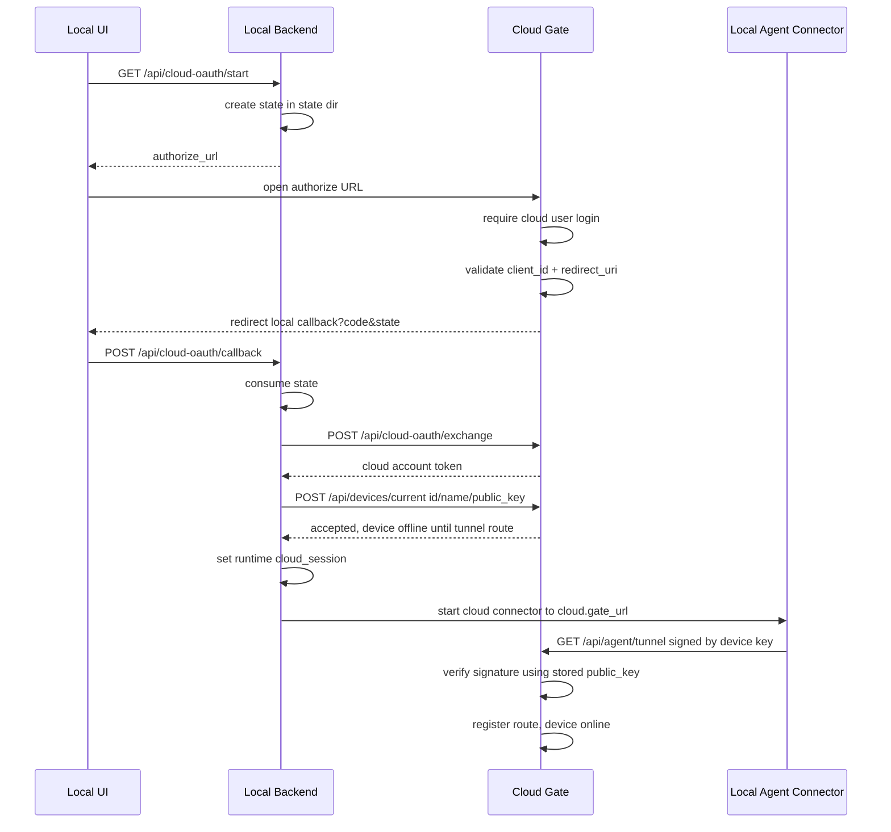

# Cloud / Local 模式分离与本机设备云端绑定规格
最后修改时间: 2026-06-30 12:00:00

Review status: Accepted

## Flow mode / Stage

严格模式 / strict；规格 / Spec 已接受，并已按实现阶段发现的问题更新为当前准确定义。

## Requirement basis

- Requirement: `docs/requirement/20260628-cloud-local-mode-enrollment.md`
- Requirement status: Accepted

## Overview

TermBridge 通过一个显式 Web runtime mode 区分本机控制台与云端门户：

```text
web.mode = local
  -> 本机 Agent 控制台
  -> 打开 agent.public_url 进入 /dashboard
  -> 不提供本地账号登录 / 注册 / 找回密码主路径
  -> 通过 agent.connect_url / agent.listen_url 建立本机 self-tunnel
  -> 可通过 cloud.gate_url 发起 Cloud Gate OAuth2
  -> OAuth2 callback 成功并上报设备 public_key 后，才启动指向 cloud.gate_url 的 cloud connector

web.mode = cloud
  -> Cloud Gate 门户
  -> 提供账号登录 / 注册 / 找回密码 / Google OAuth
  -> 登录后进入 /dashboard
  -> 展示当前 cloud user 绑定的设备
  -> Agent tunnel 由已绑定设备使用 device private key 签名接入
```

核心配置边界：

- `web.mode` 是 Web 账号能力和部署语义开关。
- `web.mode=cloud` 只用于 Cloud Gate 部署，不是本机运行时的“云端模式切换”。
- `agent.*` 是本机配置节点：listen/public/self-tunnel/device identity。
- `agent.connect_url` 只表达本机 self-tunnel target；为空时默认等于 `agent.listen_url`。
- `cloud.gate_url` 是本机连接 Cloud Gate 的唯一云端目标配置。
- 本机 local serve 可以同时拥有 self connector 和 cloud connector，但 cloud connector 只在 OAuth2 绑定成功后启动。
- 设备绑定记录与设备 online 状态分离：绑定由 DB user-device 关系表达；online 由 Cloud Gate runtime tunnel route 表达。

## Design decisions

### 1. 显式 `web.mode`

配置：

```yaml
web:
  mode: local # local | cloud
```

默认值：`local`。

校验规则：

- 空值归一化为 `local`。
- 只接受 `local` / `cloud`。
- 非法值启动失败。
- 不再通过 `agent.connect_url == agent.listen_url` 推导 mode。

### 2. 配置节点语义

本机 Agent 配置：

```yaml
agent:
  listen_url: http://127.0.0.1:9030
  public_url: http://localhost:9031
  connect_url: ""
  device_id: ""
  device_name: ""
```

含义：

- `listen_url`：本机 backend API 监听地址。
- `public_url`：浏览器访问本机前端的地址，也是 OAuth2 local redirect 的基础。
- `connect_url`：本机 self-tunnel 目标；为空表示使用 `listen_url`。
- `device_id` / `device_name`：本机设备身份。

云端配置：

```yaml
cloud:
  gate_url: http://termbridge.lvh.me
  oauth:
    client_id: termbridge-local
    client_secret: ""
    redirect_url: http://localhost:9031/cloud/oauth/callback
    scopes:
      - openid
      - email
      - profile
```

含义：

- `cloud.gate_url`：Cloud Gate 外部访问地址；本机 cloud connector 目标也来自这里。
- `cloud.oauth.client_id` + `cloud.oauth.redirect_url`：Cloud Gate 端注册的 local OAuth client 配置。
- `redirect_url` 必须与 Cloud Gate 校验的 redirect URI 精确一致；`localhost` 与 `127.0.0.1` 不可互换。

### 3. Dashboard 单页面 mode 分支

继续使用一个 `/dashboard` route 和一个 `DashboardView`。

Local dashboard：

- 展示本机设备。
- 展示 workspace/session 入口。
- 展示 Cloud Gate 配置状态。
- 展示“连接云端账号”主操作。
- 展示 runtime-only `cloud_session` 摘要。

Cloud dashboard：

- 展示当前 cloud user 的设备列表。
- 展示空状态。
- 展示 online/offline。
- online device 可进入 `/sessions` workbench；offline device 不可连接。

### 4. Capabilities 与 local cloud session

`/api/auth/me` 需要区分 capability 与当前连接状态。

Local mode 未认证响应示例：

```json
{
  "authenticated": false,
  "capabilities": {
    "mode": "local",
    "account_auth_enabled": false,
    "cloud_oauth_enabled": true
  },
  "cloud_session": {
    "gate_url": "http://termbridge.lvh.me",
    "device_id": "dev-1",
    "device_name": "local-device",
    "connected_at": "2026-06-30T10:00:00Z"
  }
}
```

约束：

- `cloud_session` 是 local backend 当前进程 runtime 摘要；可以在进程重启后丢失。
- `cloud_session` 不包含 Browser JWT、Google token、binding code、device private key 或其他 secret。
- `cloud_session` 不等于 cloud connector online；online 以 Cloud Gate runtime route 为准。

### 5. 本地 OAuth2 start

前端 route：

```text
/cloud/oauth/start
```

后端 API：

```http
GET /api/cloud-oauth/start?redirect=/dashboard
```

职责：

1. 仅 local mode 可用。
2. 校验 `cloud.gate_url`、`cloud.oauth.client_id`、`cloud.oauth.redirect_url` 配置齐备。
3. 使用 state dir 创建短期 state。
4. state 绑定：callback URL、post-auth redirect、gate URL、device id、device name、过期时间。
5. 用 `golang.org/x/oauth2` 构造 Cloud Gate authorize URL。
6. 返回 JSON：

```json
{
  "authorize_url": "http://termbridge.lvh.me/oauth2/authorize?..."
}
```

说明：第一版实现采用前端 route 调 API 并跳转，而不是后端对 `/cloud/oauth/start` 直接 302。产品语义不变：这是本机发起云端账号授权的入口。

### 6. Cloud Gate OAuth authorize

Cloud 前端 route：

```text
/oauth2/authorize
```

兼容 / 产品 alias：

```text
/cloud/connect/authorize
```

Cloud 后端 API：

```http
GET /api/cloud-oauth/authorize?client_id=...&redirect_uri=...&state=...
```

职责：

1. 仅 `web.mode=cloud` 可用；local mode 返回 not found。
2. 要求 cloud user Browser JWT。
3. 拒绝 local admin provider。
4. 校验 `client_id` 精确等于 Cloud Gate 配置的 `cloud.oauth.client_id`。
5. 校验 `redirect_uri` 精确等于 Cloud Gate 配置的 `cloud.oauth.redirect_url`。
6. 要求 state 非空。
7. 生成短期一次性 binding code。
8. 返回 local callback redirect URL：

```json
{
  "redirect_url": "http://localhost:9031/cloud/oauth/callback?code=...&state=..."
}
```

### 7. 本地 OAuth2 callback

前端 route：

```text
/cloud/oauth/callback?code=...&state=...
```

后端 API：

```http
POST /api/cloud-oauth/callback
Content-Type: application/json

{"code":"...","state":"..."}
```

职责：

1. 仅 local mode 可用。
2. 校验 code/state 非空。
3. 从 state dir 完成并消费 pending attempt。
4. 调用 Cloud Gate `POST /api/cloud-oauth/exchange`。
5. 用 exchange 返回的 cloud account access token 调用 Cloud Gate `POST /api/devices/current`。
6. 设备上报成功后设置 local runtime `cloud_session`。
7. 触发本机 cloud connector 启动。
8. 返回：

```json
{
  "cloud_session": {
    "gate_url": "http://termbridge.lvh.me",
    "device_id": "dev-1",
    "device_name": "local-device",
    "connected_at": "2026-06-30T10:00:00Z"
  },
  "redirect": "/dashboard"
}
```

失败处理：

- state missing / expired / reused：401 或对应 API error。
- cloud exchange 失败：502 upstream。
- device report 失败：502 upstream。
- 本地 device identity 或 public key 缺失：callback 失败，不启动 cloud connector。

### 8. Cloud OAuth exchange

Cloud 后端 API：

```http
POST /api/cloud-oauth/exchange
Content-Type: application/json

{"code":"..."}
```

职责：

1. 仅 `web.mode=cloud` 可用；local mode 返回 not found。
2. 消费一次性 binding code。
3. 根据 binding code 找到 cloud user。
4. 签发 cloud account access token。
5. code 只能使用一次。

响应：

```json
{
  "access_token": "...",
  "token_type": "bearer"
}
```

### 9. 当前设备上报

Cloud 后端 API：

```http
POST /api/devices/current
Authorization: Bearer <cloud-account-access-token>
Content-Type: application/json

{
  "id": "device-id",
  "name": "device-name",
  "public_key": "base64-ed25519-public-key"
}
```

职责：

1. 要求 cloud user token。
2. 要求 `id`、`name`、`public_key` 均非空。
3. Upsert device。
4. Upsert user-device binding。
5. 保存 public key。
6. 返回 device summary。

响应中的 `device.online` 来自 runtime registry：

- 如果 Cloud Gate 当前已有该 device active tunnel route，则 online。
- 如果只是刚上报绑定但 tunnel 尚未连上，则 offline。

### 10. Agent tunnel 与 online 状态

本机 local serve 的 connector 分两类：

1. Self connector
   - 目标：`agent.connect_url`，为空时为 `agent.listen_url`。
   - 启动时立即运行。
   - 用于本机统一 Gateway API / self-tunnel。

2. Cloud connector
   - 目标：`cloud.gate_url`。
   - 启动条件：OAuth2 callback 成功 + device report 成功。
   - 未完成 OAuth2 前不得启动，避免 Cloud Gate 大量 401。

签名规则：

- Agent tunnel 请求使用本机 device private key 签名。
- Cloud Gate 用 DB 中 `devices.public_key` 验签。
- Cloud Gate deployment 的 tunnel audience 使用 `cloud.gate_url`。
- local self-tunnel audience 使用 `agent.connect_url`。

online 规则：

- `POST /api/devices/current` 只建立绑定，不保证 online。
- `/api/agent/tunnel` 验签成功、hello 成功并注册 route 后，设备才 online。
- tunnel 断开或删除绑定后，设备 offline。

### 11. App startup

`termbridge serve` local mode：

1. Ensure local identity。
2. Load/Create device。
3. Upsert local device。
4. 启动 backend。
5. 启动 self connector。
6. 不立即启动 cloud connector。
7. OAuth2 callback 成功后启动 cloud connector。

`termbridge serve` cloud mode：

1. 不 Ensure local identity。
2. 不创建本机 device identity。
3. 不启动 self connector 或 cloud connector。
4. 作为 Cloud Gate 接收 Browser 登录、device report、agent tunnel。

### 12. Setup token / local_access

旧 setup token / local_access 主路径不再作为正式本机入口：

- local `/dashboard` 不依赖 setup token。
- local `/sessions` 不依赖 Browser JWT。
- `/setup` 如保留，必须退回 dashboard 或退出正式路径。

## Interfaces

### Local config example

```yaml
web:
  mode: local

agent:
  listen_url: http://127.0.0.1:9030
  public_url: http://localhost:9031
  connect_url: ""

cloud:
  gate_url: http://termbridge.lvh.me
  oauth:
    client_id: termbridge-local
    redirect_url: http://localhost:9031/cloud/oauth/callback
```

### Cloud config example

```yaml
web:
  mode: cloud

cloud:
  gate_url: http://termbridge.lvh.me
  oauth:
    client_id: termbridge-local
    redirect_url: http://localhost:9031/cloud/oauth/callback
```

Cloud deployment 不需要把 `agent.connect_url` 设置成 Cloud Gate URL。

## Key flow diagrams

### 本地 OAuth2 绑定与 cloud connector 启动



## Alternatives rejected

### A. 用 `agent.connect_url` 切换云端连接

拒绝。

原因：

- `agent` 节点是本机配置，不是云端配置。
- `agent.connect_url` 已承担 self-tunnel target 语义。
- 用它指向云端会破坏本机 self-tunnel，并重新引入“模式切换”混淆。

### B. local serve 启动时立即连接 Cloud Gate

拒绝。

原因：

- OAuth2 未完成前 Cloud Gate 没有 user-device binding 和 public key。
- 立即连接会产生持续 401 / unauthorized tunnel 请求。
- 正确边界是绑定完成后再启动 cloud connector。

### C. 绑定成功即显示 online

拒绝。

原因：

- 绑定是持久关系。
- online 是 runtime route。
- 将二者合并会让 Cloud dashboard 状态失真。

## Risks

1. OAuth2 redirect 精确匹配导致配置错误时失败更早、更严格；这是安全边界，不能放宽成 loopback 任意匹配。
2. Cloud connector 启动依赖 callback 成功；如果 callback 页面或 API 失败，设备会绑定失败或保持 offline。
3. Cloud Gate `cloud.gate_url` 与 local cloud connector 签名 audience 必须一致。
4. local mode 无 Browser auth 仍需要后续补 non-loopback 暴露保护。
5. 单个 DashboardView 需要控制条件复杂度，避免 local/cloud 文案混淆。

## User review notes

实现阶段用户澄清后，本 Spec 从“cloud connect 可由配置直接连接”修正为：

- `agent.connect_url` 不承担云端连接配置。
- `cloud.gate_url` 是云端连接唯一目标。
- OAuth2 完成前不启动 cloud connector。
- 设备上报必须包含 public key，否则 Cloud Gate 无法验证后续 tunnel 签名。
