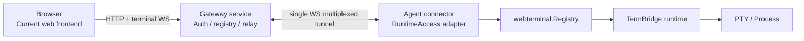
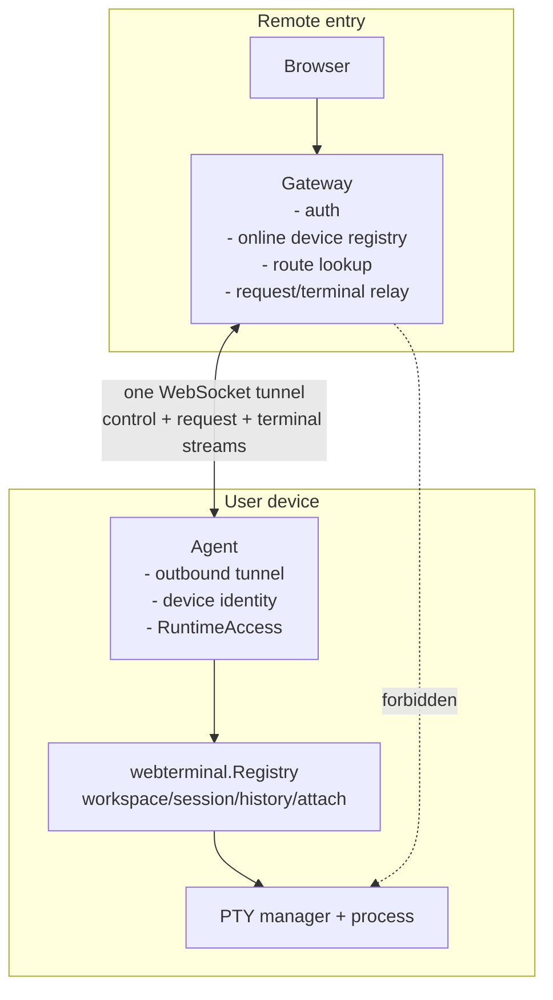
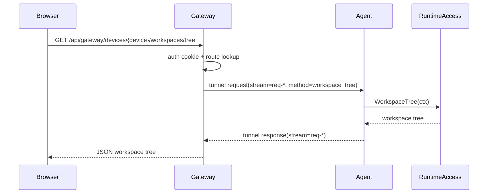
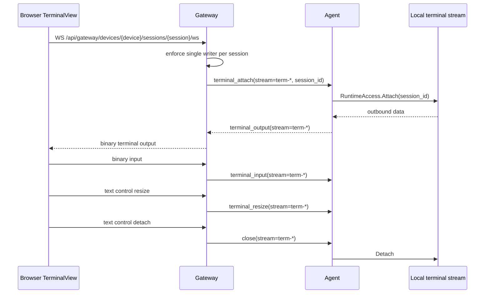

# M6 Gateway Web Terminal MVP 验证
最后修改时间: 2026-06-22 14:20:00

Review status: Accepted

## Requirement alignment

对照 `docs/requirement/20260620-m6-gateway-web-terminal-mvp.md`：

- 已实现 Gateway service / Agent connector 使用同一 `termbridge` binary，并在 M6.1 后统一为 `termbridge serve` 启动入口。
- 已实现 Agent outbound tunnel，Gateway 作为 Browser API 和 terminal relay 入口。
- 已实现临时 `admin/admin` 登录、logout、me 和 cookie auth。
- 已实现 Gateway device registry、online/offline route state。
- 已实现 Browser 通过 Gateway list workspace tree、list sessions、read history。
- 已实现 Gateway terminal attach 已有 session、input/output/resize/detach relay。
- 已实现每个 session 单 browser writer 约束。
- 已在当前前端中接入 Gateway 能力，没有创建第二套 frontend，也没有引入 Gateway mode 产品概念。
- Gateway 下不支持 session creation/mutation；前端通过 current backend abstraction 禁用 mutation 入口。
- 已移除 `web.cwd_allowlist` 配置和 Web terminal cwd allowlist 业务校验；session cwd 仍保留 `~` 展开、绝对路径和 symlink 规范化。
- M6.1 已将 Gateway/Agent 对外入口收口为 `termbridge serve` / `just serve`，并将 Gateway/Agent 运行参数收口到配置。

## Spec alignment

对照 `docs/spec/20260620-m6-gateway-web-terminal-mvp.md`：

- Gateway 没有直接拥有 PTY/process lifecycle；Gateway 通过 tunnel relay 到 Agent。
- Agent 通过 `RuntimeAccess` / `webterminal.Registry` adapter 访问本地 runtime。
- Browser ↔ Gateway terminal WebSocket 继续使用现有 `termbridge.terminal.v1` 协议；Gateway ↔ Agent tunnel 使用内部 JSON frame。
- 当前前端复用 `WorkspaceSessionSidebar`、`TerminalView`、`HistoryTerminalView`，local/Gateway 差异集中在 `activeBackend` 的 API path、history reader、terminal WS URL 和 mutation capability。
- `justfile` 的 M6 初始启动与验证入口已由 M6.1 收口为 `just serve` 和通用检查命令；历史命令结果在本文档中保留为 M6 当时的验证记录。

## Plan alignment

对照 `docs/plan/20260620-m6-gateway-web-terminal-mvp.md`：

- Step 1-10 已进入实现范围并通过自动化检查覆盖核心路径。
- Step 11 Pomelo PW flow 已在 M6 验证期创建并运行通过；M6.1 后 milestone 入口已删除，flow 文件本身作为验证资产保留。
- Step 12 本文档记录验证结果、架构图、流程图、命令结果和未完成项。

## Architecture and flow diagrams

### M6 topology



### Architecture boundary



### Gateway API relay flow



### Terminal attach relay flow



### Frontend backend selection flow

```mermaid
flowchart TD
    Workbench[Current workbench components] --> Backend[activeBackend]
    Backend -->|local| LocalAPI[/api/workspaces + /api/sessions]
    Backend -->|gateway device selected| GatewayAPI[/api/gateway/devices/{device}/...]
    Workbench --> TerminalView[TerminalView]
    TerminalView -->|local| LocalWS[/api/sessions/{session}/ws]
    TerminalView -->|gateway| GatewayWS[/api/gateway/devices/{device}/sessions/{session}/ws]
```

## Actual diff summary

主要变更：

- `internal/gateway/server.go`
  - Gateway terminal WS 兼容现有 Browser terminal control messages。
  - text control `hello` / `resize` / `detach` / `ping` 不再被误当作 terminal input。
- `web/src/features/gateway/api.ts`
  - 新增 Gateway Browser API client。
- `web/src/App.vue`
  - 新增 Gateway 登录、device selection、current backend abstraction。
  - 使用 `activeBackend` 统一 local/Gateway workspace tree、history、terminal WS URL。
  - Gateway 下禁用 mutation。
- `web/src/components/workspace/WorkspaceSessionSidebar.vue`
  - 增加 `allowMutations`，复用 sidebar 并按 backend capability 隐藏 mutation controls。
- `web/src/i18n.ts`
  - 增加 Gateway 相关中英文文案。
- `justfile`
  - 当前开发入口已收口为 `just serve`，M6 专用 target 不再保留。
  - 通用验证入口保留为 `just test`、`just check`、`just build`；组合命令按“前端在前、后端在后”组织，`check` 直接覆盖前端 typecheck/lint/format/test 与后端 Go fmt/vet/test。
- `internal/config/config.go`、`internal/webterminal/registry.go`、`.termbridge.default.yaml`
  - 移除 `web.cwd_allowlist` 配置、`CwdAllowlist` wiring 和 cwd containment 业务校验。
  - 保留 session cwd 的 `~` 展开、绝对路径、symlink eval 和目录有效性检查。
  - `web.env.denylist` 保留为子进程环境变量过滤边界，不影响 cwd。
- `internal/config/config_test.go`、`internal/webterminal/registry_test.go`
  - 移除 cwd allowlist 专项测试和构造参数，保留 cwd 展开与 session 创建相关覆盖。
- `docs/spec/20260620-m6-gateway-web-terminal-mvp.md`
  - 保留设计结论并指向 verification 中的图。
- `docs/plan/20260620-m6-gateway-web-terminal-mvp.md`
  - 记录 M6 just entries。

## Expected vs actual changed files

### Expected

- Gateway / Agent / tunnel backend files。
- Current frontend API/UI integration files。
- Process docs and verification docs。
- Developer command entrypoint file。
- Cwd allowlist removal touched config/runtime wiring and related tests as an implementation cleanup requested during verification。

### Actual

- 与预期一致。
- 新增 `web/src/features/gateway/api.ts`。
- 新增本 verification 文档。
- 未创建第二套 frontend。
- 额外移除 cwd allowlist 相关配置和业务逻辑：`.termbridge.default.yaml`、`internal/config/config.go`、`internal/app/app.go`、`internal/webterminal/registry.go`、相关测试。

## Acceptance checklist

- [x] Gateway 和 Agent 能力使用同一个 binary；M6.1 后对外统一为 `termbridge serve`。
- [x] Agent tunnel 使用单 WebSocket 多路复用 frame。
- [x] Gateway Browser API relay 覆盖 workspace tree、sessions、history。
- [x] Agent 侧 RuntimeAccess 调用 workspace/session/history。
- [x] Terminal relay 覆盖 attach、input、output、resize、detach/close。
- [x] 每个 session 只允许一个 Browser writer。
- [x] 当前前端复用组件并接入 Gateway 能力。
- [x] Gateway 下隐藏或禁止 create/rename/delete/reorder mutation。
- [x] 添加并整理必要 just entries。
- [x] 架构图和流程图已记录到本 verification 文档。
- [x] Pomelo PW M6 flow 已创建、校验并运行通过。
- [x] 已启动 Gateway/Agent/front-end-gateway 后完成浏览器自动化端到端验证：login、device discovery、workspace/session relay。
- [x] 已移除 cwd allowlist 配置和业务校验，并通过 Go 全量测试与 web build 回归。
- [ ] Agent reconnect、20+ sessions、真实 Claude/Codex TUI、Windows 环境仍需人工验证。

## Command results

### `just --list`

M6 初始验证结果：通过。

当前关键入口包括：

```text
just serve
just web
just test
just check
just build
```

M6.1 后 milestone 专用入口不再作为当前入口保留；当前长期入口以 `just serve`、`just web`、`just test`、`just check` 和 `just build` 为准。

### Gateway 相关 Go 测试

结果：通过。

```text
ok termbridge-go/internal/tunnel
ok termbridge-go/internal/gatewayauth
ok termbridge-go/internal/gateway
ok termbridge-go/internal/agent
ok termbridge-go/internal/cli
ok termbridge-go/internal/app
```

### `just build`

结果：通过。

```text
yarn build
vue-tsc --noEmit && vite build
✓ built
```

警告：

- `node_modules/@vueuse/core` 中 `/* #__PURE__ */` annotation 被 Rolldown 忽略。
- bundle chunk size 超过 500 kB 的 Vite/Rolldown warning。

这些警告未导致构建失败，且来自依赖/打包体积提示，不是本次 M6 Gateway 实现的功能失败。

### 通用检查组合

结果：通过。

覆盖：

- 前端 typecheck / lint / format check / Vitest
- 后端 Go fmt / vet / test
- `just build`

### `go test ./...`

结果：通过。

覆盖所有 Go package 回归，包括 `internal/gateway`、`internal/agent`、`internal/tunnel`、`internal/webterminal`、`internal/pty/gopty` 等。

本轮在移除 cwd allowlist 后重新运行，结果仍通过；覆盖 `internal/config` 和 `internal/webterminal` 中的配置解析、cwd 解析和 session 创建回归。

### Cwd allowlist removal search

结果：通过。

`internal/` 下已无以下实现引用：

```text
CwdAllowlist
cwdAllowlist
web.cwd_allowlist
resolveAllowedCwd
cwd allowlist
```

仓库中剩余 cwd allowlist 文本仅位于历史过程文档，作为历史记录保留；当前默认配置和业务代码已移除该能力。

### `pomelo-pw validate .pomelo-pw/m6-gateway-web-terminal.yaml`

结果：通过。

```text
Validation passed
```

### `pomelo-pw run .pomelo-pw/m6-gateway-web-terminal.yaml -o .pomelo-pw/output-m6 --headless -v`

结果：通过。

覆盖：

- 打开 `http://localhost:9011`。
- 显示 Gateway 登录页。
- 使用 `admin/admin` 登录。
- 通过 `/api/gateway/me` 验证 authenticated。
- 通过 `/api/gateway/devices` 验证 online device：`local-dev`。
- 通过 Gateway relay 验证 workspace tree 和 sessions endpoint。
- 当前运行环境返回 `workspaceCount=1`、`sessionCount=5`、`runningSessionId=null`。
- 因没有 running session，terminal attach 分支按 flow 设计跳过；relay endpoints 已验证。

最终通过截图：

```text
.pomelo-pw/output-m6/01-gateway-login.png
.pomelo-pw/output-m6/02-device-selected.png
.pomelo-pw/output-m6/03-workspace-session-relay.png
.pomelo-pw/output-m6/04-no-running-session.png
```

说明：`.pomelo-pw/output-m6/error-step-6.png` 和 `error-step-12.png` 是调试早期失败保留的截图，不属于最终通过结果。

## Scope deviations

- 用户要求进入 Verification 后，架构图和流程图已从 Spec 移入本 Verification 文档；Spec 只保留设计结论和指向。
- Pomelo PW flow 已创建并通过；由于当前环境没有 running session，terminal attach 自动化截图分支被跳过，保留为人工或后续带 running session 的 flow 验证项。
- 用户在验证后要求移除 cwd allowlist 配置和业务；本次已作为 M6 交付前 cleanup 纳入验证记录。

## Risks

1. M6 仍使用临时 `admin/admin`，不能用于公网或生产。
2. Gateway ↔ Agent tunnel terminal output 仍是 JSON payload，极大输出场景仍需后续压测和可能的 binary framing 优化。
3. Agent reconnect、stale route cleanup、slow stream backpressure 仍需要更强的端到端与压力验证。
4. 当前 Pomelo PW 已覆盖 Gateway + Agent + Browser 的 login/device/list relay 路径；terminal attach 自动化仍依赖预先存在 running session，本次运行未覆盖该分支。
5. cwd allowlist 已移除；本地/Agent 创建 session 时不再有 cwd containment 边界，后续若需要限制工作目录，应以新的产品需求和安全模型重新设计，而不是恢复旧配置。

## Incomplete items

1. 在存在 running session 的环境中重新运行 Pomelo PW terminal attach 分支，或补充专用 setup flow。
2. 记录 Agent disconnect/reconnect 行为截图或日志。
3. 记录真实 Claude/Codex TUI 通过 Gateway attach 的人工验证。
4. 记录 Windows Agent/Gateway 连接和 runtime cleanup 验证。

## Conclusion

M6 Gateway Web Terminal MVP 的核心后端 relay、Agent RuntimeAccess、前端 Gateway capability、single-writer 约束、架构/流程图文档、cwd allowlist cleanup 和 Pomelo PW login/device/list relay flow 已完成并通过当前自动化检查。

M6.1 已进一步将入口收口为 `termbridge serve` / `just serve`，并将 Gateway/Agent 运行参数收口到配置。M6 verification 因此标记为 Accepted。

仍需继续跟踪：terminal attach 自动化分支、Agent reconnect、真实 Claude/Codex TUI、20+ sessions 和 Windows 环境验证。
